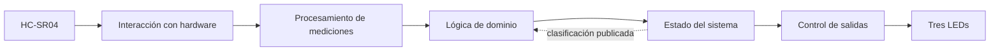
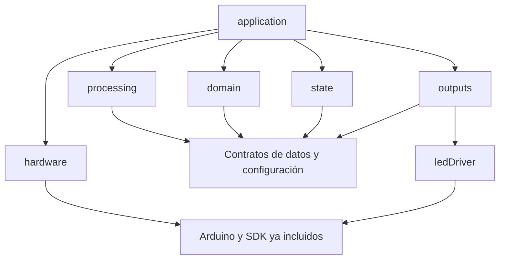
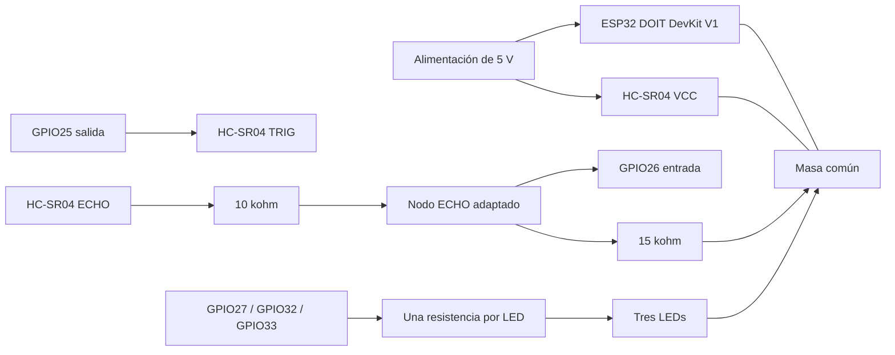

# Arquitectura de software y hardware — Sistema Inteligente de Detección de Movimiento con ESP32

## 1. Autoridad, propósito y alcance

El [PRD final del proyecto](../../prds/prd-ultrasonic-proyect-iot-2026-09-06/prd.md), estado `final`, es la fuente vinculante. Esta arquitectura define cómo implementar sus requisitos; no cambia umbrales, patrones LED, estados, pruebas ni condiciones de aceptación. Ante una contradicción prevalece el PRD y se corrige la arquitectura. Los identificadores RF, RNF, RT, C y CA conservan el significado del PRD.

Huella SHA-256 del PRD consultado: `046B357CE3EE351DF5C5F800DF54933515FCCB78F36368D99EBE56DA848F4021`. Permite detectar cambios de la fuente antes de implementar; no introduce verificación criptográfica en el firmware.

El documento está dirigido a quien implemente firmware, prepare el montaje y ejecute pruebas. Incluye decisiones estables, contratos entre componentes y una estructura inicial de archivos. Las asignaciones de pines y componentes pasivos son propuestas de implementación condicionadas a CA-14; no equivalen a un montaje validado. Los supuestos S-01 a S-04 del PRD se heredan sin ampliarlos.

Se conserva ESP32 DOIT DevKit V1, HC-SR04, tres LEDs y el entorno PlatformIO/Arduino existente. No se añaden servicios, red, almacenamiento, interfaces de usuario, sensores, actuadores, ML ni funciones de identificación de objetos. Resistencias, adaptación de ECHO, alimentación y cableado son los elementos eléctricos necesarios admitidos por RT-01. No se implementa firmware durante esta entrega documental.

## 2. Paradigma y vista general

**Arquitectura por capas con procesamiento secuencial y bucle cooperativo.** Las responsabilidades se separan mediante módulos concretos y valores de datos. No se requieren un framework de aplicación, jerarquías de interfaces virtuales, inyección de dependencias mediante contenedor ni un bus de eventos.



La flecha de retorno transporta únicamente la clasificación publicada necesaria para aplicar la histéresis de C-02. El dominio no conoce la clase gestora de estados ni los LEDs. El orden causal es **medición → validación y filtrado → análisis temporal → detección → dirección e intensidad candidatas → confirmación y estado → LEDs**.

### Responsabilidades y propiedad

| Capa / componente | Responsabilidad exclusiva | Estado que posee |
|---|---|---|
| Integración: `application` | Ejecutar el orden de cada iteración y coordinar reinicios de segmento. | Instancias de componentes; ninguna segunda copia autoritativa de clasificación. |
| Hardware: `monotonicClock` | Obtener tiempo monotónico en microsegundos. | Ningún historial de dominio. |
| Hardware: `ultrasonicDriver` | Generar TRIG, capturar ECHO y cerrar un intento con resultado o error. | Próximo disparo, fase de adquisición, plazos y un registro fijo de flancos. |
| Procesamiento: `measurementProcessor` | Convertir duración, corregir distancia, validar y producir mediana de tres. | Tres muestras crudas válidas del segmento y último tiempo de muestra. |
| Dominio: `temporalAnalyzer` | Comparar salidas filtradas separadas por la ventana configurada. | Historial circular de hasta nueve distancias filtradas. |
| Dominio: `classifyMotion` | Proponer dirección e intensidad conforme C-02. | Ninguno: función pura con clasificación publicada como entrada. |
| Estado: `systemState` | Aplicar confirmación, salud, prioridades y publicar una instantánea coherente. | Clasificación publicada, candidata pendiente, contador de confirmaciones, inválidos consecutivos y tiempos de salud. |
| Salidas: `ledController` | Traducir la instantánea a máscara y fase temporal de LEDs. | Estado/intensidad visual anterior y origen de fase. |
| Hardware de salida: `ledDriver` | Aplicar máscara lógica usando GPIO y polaridad. | Mapa eléctrico validado; opcionalmente última máscara escrita. |

La confirmación puede implementarse como funciones privadas de `systemState`; no exige una clase adicional. Las entidades anteriores expresan responsabilidades, no obligan a crear un archivo por función.

## 3. Decisiones e invariantes

Los campos Binds, Prevents y Rule identifican respectivamente qué queda vinculado, qué divergencia se evita y la regla que debe cumplir el código. Los rótulos `[ADOPTED]` señalan decisiones ya fijadas por el usuario, el PRD o el proyecto.

### AD-1 — Capas y dirección de dependencias [ADOPTED]

- **Binds — Vincula:** todos los componentes; RNF-05 a RNF-08.
- **Prevents — Evita:** clasificación ligada a GPIO, lógica de LEDs dentro del dominio y ampliación de alcance.
- **Rule — Regla:** procesamiento, dominio y estado solo usan C++ estándar y contratos comunes. Únicamente los adaptadores de hardware incluyen Arduino/ESP-IDF. `application` compone los módulos y llama sus operaciones. `ledController` no recibe distancias ni velocidades.



### AD-2 — Propietario único y publicación coherente

- **Binds — Vincula:** `application`, `classifyMotion`, `systemState`, `ledController`; RF-05 a RF-08.
- **Prevents — Evita:** dos clasificaciones vigentes, confirmar dos veces o usar la candidata pendiente como referencia de histéresis.
- **Rule — Regla:** solo `systemState` muta el estado publicado y confirma candidatas. El dominio recibe una copia inmutable de la clasificación publicada operativa; durante inicialización o recuperación recibe ausencia de clasificación previa. La instantánea contiene estado, dirección e intensidad coherentes, y se copia completa hacia salidas en la misma iteración. El dominio nunca publica directamente.

### AD-3 — Adquisición asíncrona mínima y ejecución cooperativa

- **Binds — Vincula:** adquisición, integración y sincronización; RF-01, RF-07, RNF-01.
- **Prevents — Evita:** una espera de eco de 25 ms que impida atender caducidad o salidas con plazo de 20 ms.
- **Rule — Regla:** un único `loop` de aplicación atiende adquisición, salud y LEDs sin esperar el eco. Una ISR GPIO captura exclusivamente flancos y tiempos del intento armado en un registro de capacidad uno. Se usa `attachInterruptArg` con contexto de instancia. No se crean tareas RTOS, colas ni timers con callbacks. La exclusión entre ISR y bucle se limita a copiar/actualizar ese registro; `volatile` por sí solo no basta. No hay clasificación, impresión, asignación de memoria ni esperas dentro de la ISR.

### AD-4 — Contrato temporal común

- **Binds — Vincula:** todos los cálculos temporales; RF-01, RF-04, RF-07, RNF-01/02.
- **Prevents — Evita:** desbordamiento a los 32 bits, tiempos incompatibles entre capas o velocidad calculada con un período supuesto.
- **Rule — Regla:** `timeUs` representa microsegundos monotónicos en `std::int64_t`, obtenidos en hardware de `esp_timer_get_time()`. Todas las marcas de un arranque comparten origen. `sampleTimeUs` es el inicio real de TRIG; `completedAtUs` es el tiempo de cierre observado del intento. La continuidad y la velocidad usan `sampleTimeUs`; la caducidad usa la marca de adquisición de la última muestra válida, no el momento en que el bucle la leyó. La mediana conserva el tiempo cronológico de la muestra central, no el tiempo de la muestra que aportó el valor mediano. Tiempos no crecientes se tratan según C-02, sin generar velocidad. Reiniciar borra el historial completo.

### AD-5 — Calidad del dato y segmento indivisible [ADOPTED]

- **Binds — Vincula:** `measurementProcessor`, `temporalAnalyzer`, reinicio de confirmaciones; RF-02 a RF-04.
- **Prevents — Evita:** movimiento inventado por ceros sustitutos, filtros que conservan muestras tras errores y filtros que eliminan cambios sostenidos.
- **Rule — Regla:** convertir duración positiva de eco a centímetros mediante la constante documentada `echoUsPerCm = 58.0F`; aplicar escala y desplazamiento del PRD antes de comprobar finitud y rango inclusivo. Usar solo mediana móvil de tres y la ventana de C-02. Una medición inválida borra filtro, historial temporal y confirmación. Una discontinuidad de tiempo hace lo mismo y permite que la muestra válida actual sea la primera del nuevo segmento. No añadir suavizados, normalizaciones o límites de salto adicionales.

### AD-6 — Clasificación reproducible [ADOPTED]

- **Binds — Vincula:** `classifyMotion`, `systemState`; RF-04 a RF-06.
- **Prevents — Evita:** movimiento basado en proximidad, fronteras distintas entre dirección e intensidad y cambios prematuros.
- **Rule — Regla:** calcular `radialVelocityCmPerSec = deltaDistanceCm / elapsedSeconds` con tiempos efectivos reales. Implementar literalmente C-02: signo negativo acerca, positivo aleja; entrada inclusiva ≥, salida inclusiva ≤, bandas conservan la clasificación publicada; dirección nueva reinicia la evaluación de intensidad por entradas. La candidata completa debe repetirse `confirmationCount` veces. Igualar la publicada cancela un cambio pendiente; cambiar candidata reinicia el conteo a uno. No se añade una segunda histéresis ni confirmación en salidas.

### AD-7 — Salud, prioridad y recuperación [ADOPTED]

- **Binds — Vincula:** `systemState` y orden de integración; RF-07.
- **Prevents — Evita:** presentar estacionario por falta de eco, reutilizar dirección anterior tras recuperación o contar una interrupción varias veces.
- **Rule — Regla:** seguir C-03 con prioridad configuración inválida → sin datos válidos → inicializando/recuperando → clasificación operativa. Cada intento cerrado actualiza salud exactamente una vez. La caducidad se evalúa en cada iteración aunque el sensor esté esperando. Un estado no evaluable expone dirección e intensidad no disponibles. El reinicio de segmento responde a invalidez, discontinuidad, entrada en caducidad o reinicio del sistema, no al mero cambio entre estados no evaluables. En particular, `noValidData → recovering` no borra la primera muestra fresca ya incorporada. Un dato válido reinicia inválidos consecutivos; solo si sigue fresco permite recuperar desde fallo, sin saltar la reconstrucción completa. Un dato válido caducado actualiza salud una vez con su marca original pero no entra en filtro ni produce recuperación transitoria.

### AD-8 — Salidas derivadas del estado [ADOPTED]

- **Binds — Vincula:** `ledController`, `ledDriver`; RF-08.
- **Prevents — Evita:** patrones dependientes de distancia cruda, desfase acumulativo de parpadeo o LEDs antiguos encendidos.
- **Rule — Regla:** la única entrada de producto a `ledController` es `systemSnapshot`. Aplicar C-04; cada cambio de estado o intensidad reinicia fase encendida. La máscara lógica se calcula desde tiempo absoluto transcurrido respecto al origen de fase, no contando iteraciones. El controlador apaga todos los LEDs ajenos al patrón antes de encender los correspondientes. No utiliza `delay` para parpadear.

### AD-9 — Configuración central e inmutable

- **Binds — Vincula:** configuración, adquisición, estado y salida; RF-09/10.
- **Prevents — Evita:** umbrales duplicados, división por cero, mezclar perfiles y escribir sobre pines de una configuración rechazada.
- **Rule — Regla:** `systemConfig` centraliza exactamente los parámetros del PRD §3; las constantes técnicas de conversión, pulso y capacidades tienen nombre y unidad. Validar antes de habilitar TRIG. El perfil permanece inmutable hasta reiniciar. Un mapa de arranque `safeBoardPins`, correspondiente al cableado verificado, permite representar configuración inválida sin aplicar un mapa GPIO solicitado que haya fallado validación. Nunca se escribe ni arma interrupción en un pin solicitado inválido. Los pines físicos seguros se validan al preparar el montaje, independientemente de los ensayos de configuración inválida.

### AD-10 — Frontera eléctrica y mapa de montaje

- **Binds — Vincula:** hardware y adaptación de entrada/salida; RT-01.
- **Prevents — Evita:** 5 V sobre GPIO, LEDs sin limitación y acoplar el dominio a un pin físico.
- **Rule — Regla:** HC-SR04 alimentado a 5 V, masa común, ECHO adaptado al nivel del ESP32 y una resistencia en serie por LED. El mapa propuesto y el dimensionamiento de §5 deben verificarse mediante CA-14 antes de conectar ECHO al ESP32. No se presume tolerancia de GPIO a 5 V ni compatibilidad universal de módulos clonados. Cambiar cableado exige actualizar el perfil de placa y repetir su validación.

### AD-11 — Recursos, C++ y pruebas desacopladas [ADOPTED]

- **Binds — Vincula:** todos los módulos; RNF-03 a RNF-08.
- **Prevents — Evita:** crecimiento de memoria, abstracciones sin propósito y depender de hardware para probar reglas numéricas.
- **Rule — Regla:** C++17, tipos propios, funciones, constantes y miembros en camelCase; `enum class`, inicialización explícita y `std::array` para almacenamiento acotado. Sin asignación dinámica por muestra ni buffers crecientes. No introducir excepciones como protocolo de errores; usar resultados tipados. La única instancia persistente de integración puede ser local estática en un punto de composición; `setup` y `loop` acceden a ella, y la ISR recibe su contexto explícito. Cumplir los límites de funciones, anidamiento, advertencias y memoria del PRD. El núcleo debe compilar en host sin Arduino.

### AD-12 — Verificación y operación local [ADOPTED]

- **Binds — Vincula:** entrega, calibración y pruebas; RF-10, RNF-01 a RNF-08, RT-01.
- **Prevents — Evita:** declarar aceptación por compilación, añadir telemetría de producto o alterar silenciosamente umbrales para aprobar ensayos.
- **Rule — Regla:** verificar CA-01 a CA-14 con el perfil inicial y las reglas de recalibración del PRD. Registrar versiones, configuración y evidencia fuera del firmware. Compilación/carga local por el entorno PlatformIO existente; no OTA ni servicios. Una modificación de perfil reinicia el sistema y repite pruebas afectadas. Ningún resultado físico se da por obtenido en este documento.

## 4. Contratos e interfaces

Los siguientes contratos fijan unidades, significado y propiedad. Son la estructura inicial de integración; los nombres de carpetas pueden evolucionar sin cambiar los contratos ni los AD.

| Tipo camelCase | Campos y semántica |
|---|---|
| `rawEchoResult` | `sampleTimeUs`, `completedAtUs`, `echoDurationUs` y `echoStatus`: `complete`, `noEcho`, `incompleteEcho` o `timedOut`. Duración solo utilizable con `complete`. |
| `distanceSample` | `distanceCm` finita y corregida; `sampleTimeUs` monotónico. Solo se construye como dato utilizable tras validar. |
| `processingResult` | `measurementStatus` (`valid`, `invalid`), `invalidReason` cuando corresponde, `segmentBroken`, `sampleFresh` y `std::optional<filteredSample>`. Incluye tiempo de muestra válida para actualizar salud aunque todavía no haya mediana. Validez física y frescura son datos separados. |
| `filteredSample` | `distanceCm` mediana; `sampleTimeUs` de la muestra cronológica central. |
| `velocityResult` | Estado `notReady`, `valid` o `invalidTime`; velocidad en cm/s solo en `valid`. |
| `motionClassification` | `direction`: `stationary`, `approaching` o `receding`; `intensity`: `none`, `low`, `medium` o `high`. Estacionario implica `none`; movimiento implica una de las otras tres. |
| `systemSnapshot` | `state`: `initializing`, `stationary`, `approaching`, `receding`, `recovering`, `noValidData` o `invalidConfiguration`; `std::optional<motionClassification> classification`. Solo los tres estados operativos contienen clasificación y deben coincidir con su dirección. |
| `ledMask` | Tres booleanos: `stationaryOn`, `approachingOn`, `recedingOn`. Sin números de GPIO, distancias ni dirección implícita. |

La ausencia de valor representa «no disponible», nunca cero ni un valor anterior. `std::optional` almacena el valor en el propio objeto, sin requerir heap. Los mensajes anteriores son retornos directos de funciones, no eventos enviados a una cola.

Las cabeceras comunes son la única definición de estos tipos: distancias y velocidades usan `float`; marcas temporales usan `timeUs`; duración de eco usa `std::uint32_t`; enumeraciones son `enum class` con base `std::uint8_t`; máscaras usan `bool`. Ningún módulo redefine su propia versión del mismo contrato. Convertir duraciones y unidades antes de operar, con comprobación de rango en los límites de entrada.

| Operación conceptual | Entrada → salida | Efectos permitidos |
|---|---|---|
| `ultrasonicDriver::service` | `nowUs` → opcional `rawEchoResult` | Gestiona un intento y GPIO; entrega cada resultado una sola vez. |
| `measurementProcessor::process` | resultado crudo, `sampleFresh` → `processingResult` | Valida siempre; actualiza filtro/continuidad solo con muestra válida fresca. Si no es fresca, vacía segmento y devuelve clasificación de validez sin salida filtrada. |
| `temporalAnalyzer::push` | `filteredSample` → `velocityResult` | Actualiza únicamente historial circular. |
| `classifyMotion` | velocidad, clasificación publicada opcional, configuración → candidata | Ninguno; función pura. |
| `systemState::onMeasurement` | validez, tiempo de muestra, frescura y ruptura de segmento | Actualiza salud y estado no evaluable una sola vez, priorizando caducidad sobre recuperación. No realiza conversión ni filtro. |
| `systemState::onCandidate` | candidata → instantánea consultable | Confirma y publica cuando corresponde. |
| `systemState::onTemporalDiscontinuity` | error temporal → estado no evaluable | Inicia recuperación, salvo que prevalezca configuración inválida o sin datos válidos; borra confirmación sin contar una segunda medición inválida. |
| `systemState::checkFreshness` | `nowUs` → indicador de transición | Aplica caducidad incluso sin mediciones completas. |
| `resetSegment` en integración | sin datos → componentes vacíos | Coordina `reset` de filtro, historial y confirmación; no borra salud salvo en reinicio total. |
| `ledController::update` | instantánea, `nowUs` → `ledMask` | Actualiza fase; sin acceso al sensor. |
| `ledDriver::write` | máscara → GPIO | Aplica polaridad/mapa eléctrico. |

`invalidReason` distingue ausencia/eco incompleto/plazo, dato no finito y fuera de rango para pruebas internas. No atribuye causa física como «sensor desconectado». No se requiere una consola para exponerlo.

## 5. Arquitectura de hardware



| Señal / rol | Propuesta | Condición de montaje |
|---|---|---|
| `triggerPin` | GPIO25, salida, reposo bajo | Pulso alto `triggerPulseUs = 10`; confirmar respuesta del TRIG real a 3,3 V. |
| `echoPin` | GPIO26, entrada sin pull-up a 5 V | Recibir únicamente la señal adaptada. |
| `stationaryLedPin` | GPIO27 | LED por resistencia hacia masa, activo alto como perfil inicial. |
| `approachingLedPin` | GPIO32 | Igual conexión, identificado por posición/etiqueta. |
| `recedingLedPin` | GPIO33 | Igual conexión, identificado por posición/etiqueta. |

Estos GPIO son de entrada/salida en ESP32 clásico y evitan los pines de flash y los de entrada exclusiva. La exposición de la placa física se verifica antes del montaje. La polaridad puede cambiar por configuración, preservando los roles lógicos.

**Adaptación ECHO propuesta:** resistencia superior de 10 kΩ entre ECHO y nodo, resistencia inferior de 15 kΩ entre nodo y GND, ambas de 1 %. La división nominal es `5 × 15 / (10 + 15) = 3,0 V`. Esta cuenta es un dimensionamiento inicial, no garantía del nivel alto real del módulo. Medir nivel alto y bajo en el nodo y contrastarlos con los límites VIH/VIL y máximos de la hoja de datos del ESP32 alimentado realmente. La ficha genérica del HC-SR04 no fija todos los valores VOH/VOL de los clones.

**LEDs:** seleccionar cada resistencia mediante `resistanceOhm ≥ (gpioHighVoltage - ledForwardVoltage) / ledCurrentAmp`, con datos del LED concreto, tolerancias y límites GPIO. Como punto inicial de montaje puede evaluarse 1 kΩ por LED; CA-14 confirma corriente y CA-09 visibilidad. No se exige un color ni corriente de producto nuevos.

Usar una alimentación de 5 V estable compatible con la entrada de la placa y el sensor, y masa común. Documentar la ruta de alimentación real; no conectar dos fuentes de 5 V entre sí sin verificar el diseño de la placa. El HC-SR04 no se alimenta desde una salida GPIO. Si el módulo no acepta el TRIG disponible o no entrega niveles utilizables, la validación del montaje queda pendiente; no se incorpora automáticamente otro módulo o hardware fuera del PRD.

El mapa de arranque seguro debe corresponder al montaje real y mantener TRIG bajo. Primero se inicializan esos LEDs; después se valida la configuración solicitada. Ante un mapa solicitado duplicado o no permitido se conservan los LEDs seguros encendidos y no se habilita adquisición. El mapa seguro no es un segundo conjunto de umbrales ni un perfil de calibración; es la definición eléctrica mínima de la placa. Una placa mal cableada no puede diagnosticarse ni repararse por software.

## 6. Adquisición y planificación temporal

### Ciclo del sensor

El controlador tiene fases internas `idle`, `waitingRise`, `waitingFall` y `completed`. No son nuevos estados visibles del producto. Un intento comienza como máximo una vez por período. Antes de armarlo, TRIG está bajo y ECHO debe estar bajo; ECHO ya alto produce un intento inválido con eco incompleto, sin simular distancia.

Se arma el registro bajo sección crítica, se fecha el inicio de TRIG y se genera el pulso alto de 10 µs. Ese pulso corto es la única espera activa prevista en la aplicación. La ISR de cambio de nivel acepta el primer ascenso y el primer descenso posterior del intento; después ignora otros flancos. El bucle valida orden y plazo y calcula duración fuera de la ISR.

El plazo absoluto es `sampleTimeUs + echoTimeoutUs`, incluyendo toda la espera desde el disparo. Sin ascenso al vencer: `noEcho`; ascenso sin descenso: `incompleteEcho`; par de flancos completado fuera de plazo: `timedOut`. Un par completo con descenso exactamente en el plazo se admite. Al consultar el registro se decide usando los tiempos capturados: un eco completado en plazo no se rechaza solo porque el bucle lo leyó más tarde. Se desarma al cerrar el intento; el registro se vacía antes del próximo. No existen varios intentos simultáneos ni resultados acumulados.

Secciones críticas compartidas entre ISR y bucle protegen copia coherente de marcas de 64 bits, fase y banderas. Se usan las primitivas ya incluidas en el framework; no se crean tareas propias. La ISR y las llamadas que haga deben verificarse contra la configuración de interrupciones del framework instalado; no se presume que un atributo por sí solo haga todo el código residente en IRAM.

### Bucle y orden de servicio

1. Leer `nowUs`. Comprobar caducidad de la última muestra válida; si cambia a no evaluable, reiniciar segmento y actualizar LEDs inmediatamente.
2. Atender adquisición: cerrar el intento pendiente o iniciar uno si venció su período y no hay otro activo. Como máximo un inicio por iteración. Planificar el siguiente desde el inicio real actual más `samplePeriodMs`; nunca recuperar períodos perdidos en ráfaga.
3. Si hay resultado, calcular una sola vez `sampleFresh` con el reloj actual: edad no negativa y estrictamente menor que `staleTimeoutMs`. Pasar esa bandera al procesador y a salud. Procesar el resultado una vez. Ante ruptura, reiniciar historial temporal y confirmación; el procesador ya ha reiniciado su filtro y, si corresponde, conservado la muestra válida fresca actual como primera del segmento. No llamar después a un reinicio que vuelva a perder esa muestra.
4. Actualizar salud con `onMeasurement`. Si hay salida filtrada y estado habilitado para recuperación/análisis, calcular velocidad y candidata; `systemState` aplica confirmación. Un error temporal reinicia segmento e inicia recuperación sin publicar velocidad.
5. Volver a leer el reloj, comprobar caducidad y aplicar la instantánea a LEDs antes de terminar la iteración.

Ante caducidad y un resultado válido que llegan a la misma iteración, primero se reconoce la caducidad y se corta el segmento. El resultado se admite únicamente si su propia marca sigue fresca; inicia recuperación. Esto impide reactivar movimiento con un resultado retenido demasiado tiempo. `invalidLimit` cuenta resultados de medición inválidos, no iteraciones de espera ni rupturas de tiempo con muestra válida.

Si el eco es válido pero `sampleFresh` es falso, se registra una medición válida a efectos de salud: reinicia el contador de inválidos y actualiza la última marca válida únicamente si es posterior a la registrada. No se rejuvenece esa marca usando el tiempo de lectura. El segmento permanece vacío, no hay candidata y el estado queda `noValidData` por caducidad, sin pasar transitoriamente por recuperación. Así se consume el intento exactamente una vez sin equiparar «válido» con «todavía utilizable». La próxima muestra válida fresca es la primera del segmento; nueve más concordantes completan la primera publicación del perfil inicial.

El presupuesto interno de diseño es atender servicios al menos cada 1 ms en operación normal, con secciones críticas breves. Es una asignación de margen para cumplir RNF-01 y CA-09, no una prestación nueva al usuario. No hay espera de 25 ms, impresión por muestra ni llamadas de red. El cumplimiento real de período 100 ± 10 ms y latencia LED ≤ 20 ms se mide: no se deriva exclusivamente del uso de interrupciones.

### Ventana y latencia

Con filtro de tres, retardo de `L = analysisLagSamples` posiciones y `C = confirmationCount`, la primera evaluación requiere `L + 3` muestras válidas y la primera publicación concordante `L + C + 2`. Para L=5 y C=3 resultan ocho y diez muestras, respectivamente. La fórmula asume estímulos concordantes del PRD; no promete confirmar una candidata que cambia continuamente.

Para validar un perfil se utiliza una cota conservadora de arranque/ventana/confirmación:

`classificationBoundMs = (L + C + 2) × (samplePeriodMs + sampleToleranceMs) + echoTimeoutUs / 1000 + 2 + 20`

Los términos finales reservan cierre de adquisición y actualización de salida según los límites del PRD. Los valores se representan mediante constantes con nombre en código. Perfil inicial: 1147 ms, dentro de 1,2 s para arranque y 2 s de configuración. La respuesta a inicio/parada/inversión debe comprobarse además con CA-05/08; esta cuenta no sustituye sus ensayos de rampas ni demuestra rendimiento físico. Rechazar perfiles cuya cota supere 2000 ms o cuyos cálculos desborden.

## 7. Procesamiento, dominio y estado

### Procesamiento de mediciones

La duración se convierte mediante `distanceCm = echoDurationUs / echoUsPerCm`. Después se aplica `distanceScale × distanceCm + distanceOffsetCm` y se valida el rango inclusivo 10–200 cm del perfil inicial. El factor 58 proviene de la ficha del sensor; escala/desplazamiento absorben correcciones de calibración previstas por el PRD, sin sensor térmico.

Las tres muestras se conservan en orden temporal. La mediana ordena una copia local de tres valores; no reordena sus tiempos en el historial. Se comprueba continuidad con el intervalo real entre marcas de disparo y la tolerancia configurada. Un dato inválido no ocupa una posición. Una interrupción elimina todo el segmento; no se interpola, extrapola ni sustituye por la última distancia.

`temporalAnalyzer` almacena un máximo de nueve salidas filtradas, suficiente para el máximo L=8 del PRD. Con al menos L+1, resta la salida actual y la situada L posiciones atrás. El delta temporal se convierte explícitamente de microsegundos a segundos antes de dividir. Distancia absoluta no interviene en el clasificador.

### Clasificación y confirmación

Con el perfil inicial: movimiento entra a módulo ≥4 cm/s y sale a ≤2; media entra a ≥12 y sale a ≤10; alta entra a ≥25 y sale a ≤22. Se conserva la clasificación publicada dentro de la banda de movimiento 2–4, aunque cambie el signo. Para igual dirección, las bandas de intensidad siguen C-02; para nueva dirección se elige intensidad por umbrales de entrada. No se publica un estacionario artificial entre direcciones.

La comparación de candidatas incluye dirección e intensidad. Desde estado no evaluable, tres candidatas iguales del perfil inicial publican la primera clasificación. Una inválida borra la candidata pendiente. Las fronteras se evalúan sin un épsilon añadido: las pruebas ±0,01 de CA-06 validan el comportamiento numérico.

### Estado público

| Condición | Resultado y acción |
|---|---|
| Configuración rechazada | `invalidConfiguration`; sin TRIG; todos los LEDs encendidos. |
| Inicio con configuración válida | `initializing`; historial vacío, clasificación ausente. |
| Candidata confirmada | Estado operativo coincidente y clasificación disponible. |
| Primer inválido o ruptura desde operativo | `recovering`; clasificación ausente, segmento nuevo. |
| Inválido durante inicialización, sin alcanzar fallo | Conservar `initializing`, borrar segmento/candidata. |
| Tercer inválido consecutivo o edad ≥350 ms, perfil inicial | `noValidData`; clasificación ausente. |
| Primer válido fresco desde `noValidData` | `recovering`; iniciar historial nuevo. |
| Confirmación tras reconstrucción | Publicar clasificación sin reutilizar referencia anterior al fallo. |

La salud se actualiza con cada muestra válida aun sin haber mediana; la primera mediana no determina cuándo el sensor volvió a dar datos. Mientras no haya ninguna muestra válida, la referencia de caducidad es el inicio del sistema. Los contadores de confirmación e invalidez se saturan en sus límites para evitar desbordamiento.

## 8. Control de LEDs

La tabla C-04 del PRD es normativa. Estacionario: solo su LED fijo. Acercándose o alejándose: solo el LED de dirección a 1/2/4 Hz según baja/media/alta. Inicializando y recuperando: solo estacionario a `statusBlinkHz`. Sin datos válidos: los tres sincronizados a `errorBlinkHz`. Configuración inválida: los tres fijos.

Para un patrón intermitente, calcular `halfPeriodUs = 1000000 / (2 × frequencyHz)`. La fase está encendida cuando el número entero de semiperíodos desde `phaseStartUs` es par. Al cambiar estado o intensidad, actualizar `phaseStartUs` y escribir fase encendida inmediatamente; si no cambia, conservarlo. Reiniciar fase cuando se pasa entre inicialización y recuperación aunque compartan patrón, como exige C-04.

`ledDriver` traduce encendido lógico a nivel físico según polaridad. Actualizar una máscara completa evita conservar LEDs ajenos al patrón. La pequeña separación entre escrituras GPIO no implica una nueva clasificación; CA-09 verifica sincronía, frecuencia, ciclo 50 % y transición ≤20 ms. La adquisición continúa mientras parpadea.

## 9. Configuración y calibración

La lista exhaustiva de parámetros de producto reside en PRD §3: período/tolerancia, timeout, rango, escala/desplazamiento, ventana, umbrales de movimiento e intensidad, confirmaciones, límite de inválidos, caducidad, frecuencias, GPIO y polaridad. `systemConfig` mantiene sus nombres y valores iniciales. Ningún componente contiene una copia alternativa de esos valores.

Separar constantes técnicas con nombre (`filterSampleCount`, `maxFilteredSamples`, `triggerPulseUs`, `echoUsPerCm`, `microsecondsPerSecond`) de parámetros de calibración. No son controles nuevos para el operador. Validar todas las relaciones del PRD, finitud, capacidades, tipos y operaciones temporales, incluidos tiempo de ida/vuelta del rango máximo y cota de §6. La validación es una función comprobable sin hardware, más validación del mapa eléctrico antes de usar GPIO.

Calibración manual conforme PRD §8: 100 muestras válidas en 20/100/180 cm, error de mediana ≤2 cm y validez ≥95 %; ruido estático durante 60 s con percentil 99 por debajo del umbral de salida; movimientos ±6/16/30 cm/s con intensidades baja/media/alta. Registrar perfil, versiones, placa, módulo, montaje y resultados en el informe de pruebas. No crear un modo automático de calibración, interfaz de comandos ni persistencia de parámetros en el producto.

Editar perfil, recompilar y reiniciar para aplicar ajustes. Repetir fronteras parametrizadas y ensayos afectados sin degradar las metas físicas del PRD. Una calibración fallida no se oculta aumentando umbrales hasta dejar de detectar 6 cm/s.

## 10. Entorno tecnológico y estructura inicial

| Elemento | Versión / estado verificado |
|---|---|
| Lenguaje propio | C++17, decisión de compilación para esta implementación. |
| Plataforma PlatformIO `espressif32` | 7.1.1 instalada; `platformio.ini` actual aún no fija versión. |
| Arduino-ESP32 | 2.0.17 instalado; paquete `3.20017.241212+sha.dcc1105b`. |
| ESP-IDF transitivo del framework | 4.4.7 instalado; no se añade como segundo framework. |
| Compilador Xtensa | GCC 8.4.0, paquete `8.4.0+2021r2-patch5`. |
| Placa | `esp32doit-devkit-v1` existente. |

Son versiones observadas localmente, no una afirmación de que sean las últimas disponibles. Para implementar, conservar esta base y fijar `espressif32@7.1.1`; registrar las versiones resueltas de paquetes. Seleccionar `-std=gnu++17` eliminando el estándar anterior y habilitar `-Wall -Wextra` para el código propio. Verificar el comando efectivo de compilación. No se actualiza ni se instala software en este trabajo documental.

```text
include/
  systemConfig.h       configuración y validación declarada
  measurementTypes.h   contratos de medición y tiempo
  systemTypes.h        clasificación, estado y máscara lógica
src/
  main.cpp             setup/loop y composición
  application.cpp      orden de servicio y reinicio coordinado
  hardware/            reloj, ultrasonicDriver, ledDriver
  processing/          measurementProcessor
  domain/              temporalAnalyzer, classifyMotion
  state/               systemState y confirmación
  outputs/             ledController
test/
  host/                análisis, estado, temporización con reloj simulado
  target/              comprobaciones específicas de placa e instrumentación
```

Cabeceras correspondientes junto a sus módulos cuando no sean contratos compartidos. No se exige una biblioteca externa de pruebas: un ejecutable host con verificaciones explícitas y código de salida no cero basta. Las pruebas host no requieren compilar `hardware`; los adaptadores se verifican mediante sus contratos en placa y, donde proceda, con un registro de flancos simulado. El entorno host concreto puede utilizar un compilador C++17 disponible, sin convertirlo en dependencia de ejecución del producto.

## 11. Recursos y operación

| Área | Diseño y evidencia |
|---|---|
| Filtro | Tres muestras de tamaño fijo; copia local de tres valores para mediana. |
| Ventana | Nueve salidas filtradas como máximo; índice/tamaño acotados. |
| Captura | Un registro de flancos, sin lista creciente ni cola. |
| Estado y LEDs | Instancias únicas y contadores acotados; sin historial de operación. |
| RAM de aplicación | Suma de buffers, instancias, configuración y auxiliares ≤8 KiB; comprobar `sizeof` y mapa de enlace, incluyendo padding. |
| Memoria dinámica | Sin asignaciones por muestra; CA-12 mide memoria retenida real, incluido comportamiento del entorno. |
| Flash | Imagen ≤80 % de la partición de aplicación realmente seleccionada; no calcular contra toda la flash de la placa. |
| Ejecución | Una tarea de aplicación del framework existente; ninguna tarea propia adicional. ISR corta solo para captura. |

No se reservan buffers para historiales, red o telemetría. Se reutilizan valores y estructuras locales; no se introduce optimización por plantillas ni punto fijo sin evidencia de necesidad. El uso de `float` para distancias/velocidades y enteros de 64 bits para tiempo debe superar CA-05/06; no se usa `float` para acumular tiempo de ejecución.

Entornos: host para lógica y placa física para integración/aceptación. Despliegue local por PlatformIO y conexión de programación de la placa; aplicación autónoma después del arranque. La calibración viaja dentro del firmware compilado. No hay proveedor de infraestructura, base de datos, autenticación ni operación remota que diseñar. Ante pérdida de alimentación se reinicia en inicialización; no se recupera un historial anterior.

## 12. Estrategia de pruebas y trazabilidad

Las siguientes pruebas se planifican; no han sido ejecutadas sobre una implementación. El PRD conserva la especificación exacta de cada CA y sus reglas para el perfil calibrado.

| Requisito PRD | Responsable / decisión | Verificación |
|---|---|---|
| RF-01 | `ultrasonicDriver`, reloj, AD-3/4 | CA-01 y CA-07: intervalos, timeout y caducidad mientras espera. |
| RF-02 | `measurementProcessor`, AD-5 | CA-02/07: extremos, no finitos y ecos inválidos sin sustitutos. |
| RF-03 | Filtro y reinicio coordinado, AD-5 | CA-03/08: pico aislado, cambio sostenido y recuperación. |
| RF-04 | `temporalAnalyzer`, AD-4/6 | CA-04/05: posiciones fijas, rampas y tiempo real 90/110 ms. |
| RF-05 | `classifyMotion` y `systemState`, AD-2/6 | CA-04/05/06: signo, bandas y confirmación. |
| RF-06 | `classifyMotion`, AD-6 | CA-05/06: intensidad, fronteras e histéresis. |
| RF-07 | `systemState`, AD-7 | CA-07/08: no evaluable, prioridad y reconstrucción. |
| RF-08 | `ledController`, `ledDriver`, AD-8 | CA-09: matriz completa de estados, fases y GPIO. |
| RF-09 | `systemConfig`, mapa seguro, AD-9 | CA-10: perfiles válidos/incorrectos, sin TRIG inválido. |
| RF-10 | Configuración y calibración, AD-9/12 | CA-11: registro reproducible y límites físicos. |
| RNF-01 | Planificación e ISR, AD-3/4/8 | CA-01/09: medición de jitter, salida y bloqueo. |
| RNF-02 | Ventana y confirmación, AD-4/6 | CA-05/08: 8/10 muestras y latencias del perfil. |
| RNF-03 | Estado y almacenamiento fijo, AD-7/11 | CA-12: 60 min alternando datos válidos y ausencia de eco. |
| RNF-04 | Buffers e imagen, AD-11 | CA-12: mapa de memoria, heap y partición. |
| RNF-05 | C++17 y contratos, AD-1/11 | CA-13: camelCase y advertencias propias. |
| RNF-06 | Propiedad y separación, AD-1/2/11 | CA-13: constantes, duplicación y pruebas sin GPIO. |
| RNF-07 | Módulos y funciones, AD-11 | CA-13: ≤60 líneas, ≤3 niveles, SRP y asignaciones. |
| RNF-08 | Entorno existente, AD-11/12 | CA-13: dependencias y operación sin red. |
| RT-01 | Montaje y adaptadores, AD-10 | CA-14: niveles eléctricos, corriente y mapa real. |

Orden de comprobación: validación de configuración y lógica pura; integración con tiempo simulado; compilación de placa; inspección eléctrica; pruebas físicas; ensayo de 60 min. Las pruebas de tiempo simulado cubren eco justo en plazo/fuera de plazo, caducidad sin cierre, llegada de dato fresco después del fallo, ruptura que conserva la muestra actual y cruce de 2³² microsegundos. Esos casos concretan CA-07/08, no añaden estados de producto.

Para LEDs, comparar máscaras y fases con reloj simulado y después medir los GPIO con el sensor activo. Para la ISR, comprobar transferencia atómica y cierre único con flancos/invalidez; el reloj simulado no prueba latencia real de interrupciones. Para memoria, incluir tamaño de objetos y lectura periódica durante el ensayo. La instrumentación de prueba no obliga a entregar logs, puertos de comandos o almacenamiento de producto.

## 13. Decisiones, compromisos y riesgos

Esta sección explica las elecciones solicitadas por el usuario; los AD anteriores son el contrato de implementación y el registro `.memlog.md` conserva su procedencia.

| Elección | Alternativa considerada | Compromiso y riesgo verificable |
|---|---|---|
| ISR breve y bucle cooperativo | Espera bloqueante de eco | Una ISR exige sincronizar un registro, pero permite atender el límite de 20 ms mientras transcurre el timeout de 25 ms. CA-01/07/09 verifican el resultado. |
| Registro fijo de un intento | Tareas, colas o periférico de captura más complejo | Capacidad suficiente para un sensor y una adquisición por período. No hay procesamiento concurrente; si se pierde un plazo, se invalida/reconstruye según PRD. |
| Funciones y componentes concretos | Interfaces virtuales para cada operación | Menos estructura; la comprobabilidad proviene del núcleo sin hardware y de entradas temporales explícitas. CA-13 confirma desacoplamiento. |
| Mediana tres y diferencia temporal | Suavizados adicionales o ML | Conserva exactamente el PRD. Cambios de reflector persistentes pueden parecer movimiento; no se garantiza identidad de objeto. |
| Tiempo de 64 bits | Reloj de 32 bits y aritmética modular distribuida | Algo más de almacenamiento y copia atómica, con un solo contrato temporal y prueba de cruce. |
| Perfil compilado | Configuración persistente/interfaz en ejecución | Requiere recompilar para calibrar; evita funciones de producto no solicitadas. |
| Preservar versiones instaladas | Migrar al framework más reciente | Reduce cambios respecto al proyecto. No implica garantizar ausencia de defectos del framework; CA-12/13 y registro de versiones condicionan aceptación. |

Riesgos heredados: ecos múltiples, blanco lateral, ruido, temperatura y montaje. Se mantienen el entorno S-04 y los ensayos del PRD. Riesgos de implementación: pérdida de flanco, sección crítica demasiado larga, perfil temporal demasiado agresivo o mapa eléctrico incorrecto. Se resuelven con resultados inválidos/recuperación y verificación correspondiente, sin afirmar una causa física específica ni ocultar fallos.

La cota de configuración es conservadora y puede rechazar perfiles lentos aunque sus campos individuales estén dentro de rango; el PRD ya exige la condición conjunta de ≤2 s. Caducidades muy próximas al período pueden producir recuperación durante un eco todavía en curso: se conserva la semántica de edad del PRD y se verifica el perfil, sin relajar silenciosamente el plazo.

## 14. Decisiones diferidas y condiciones de cierre

| Pendiente de implementación o montaje | Responsable / condición | Límite ya fijado |
|---|---|---|
| Identificar variante real HC-SR04 y LEDs; confirmar mapa y resistencias | Montaje, antes de conectar y CA-14 | RT-01 y AD-10; la propuesta de §5 no certifica componentes desconocidos. |
| Validar `safeBoardPins` contra cableado real | Montaje/firmware, antes de energizar y CA-10/14 | LEDs de error independientes de un mapa solicitado rechazado; sin TRIG inválido. |
| Valores calibrados | Pruebas/firmware, CA-11 | Parámetros y metas físicas del PRD, sin nueva interfaz. |
| Verificar tiempos ISR/bucle y recursos reales | Firmware, CA-01/09/12 | Presupuestos del PRD; no sustituir medición por estimación. |
| Disposición final de archivos y utilidades privadas | Implementador al escribir código | Se pueden ajustar sin romper capas, propietarios, contratos o AD. |
| Compilador host e instrumentación concreta | Pruebas, antes de CA-13 | C++17; cero dependencias de ejecución nuevas en el producto. |

No hay una decisión funcional pendiente: comportamiento, contratos y límites vienen del PRD. La validación eléctrica y física sí es una condición previa a la aceptación del montaje y del firmware. Finalizar este documento habilita la implementación; no declara aprobado el producto.

## 15. Evidencia y fuentes técnicas

- [PRD final](../../prds/prd-ultrasonic-proyect-iot-2026-09-06/prd.md): única fuente de requisitos de producto.
- Archivos locales consultados: `platformio.ini`, `src/main.cpp`, `platform.json` de la plataforma instalada, `package.json` del framework/toolchain, `esp_arduino_version.h`, `esp_idf_version.h` y cabeceras GPIO/temporización. Verifican el entorno existente y disponibilidad de APIs; no existe aún código de detección que adoptar.
- [Placa ESP32 DOIT DevKit V1 en PlatformIO](https://docs.platformio.org/en/latest/boards/espressif32/esp32doit-devkit-v1.html): identificación y configuración de la placa.
- [Temporización ESP-IDF 4.4.7](https://docs.espressif.com/projects/esp-idf/en/v4.4.7/esp32/api-reference/system/esp_timer.html): `esp_timer_get_time()` y microsegundos desde inicialización. Se utiliza lectura de reloj, no creación de timers.
- [GPIO de Arduino-ESP32](https://docs.espressif.com/projects/arduino-esp32/en/latest/api/gpio.html): interrupciones GPIO; la API utilizada se contrastó además con el núcleo 2.0.17 instalado.
- [Hoja de datos ESP32 de Espressif](https://www.espressif.com/sites/default/files/documentation/esp32_datasheet_en.pdf): funciones de GPIO y límites eléctricos para contrastar el montaje.
- [Ficha HC-SR04 de ElecFreaks distribuida por SparkFun](https://cdn.sparkfun.com/datasheets/Sensors/Proximity/HCSR04.pdf): alimentación, pulso TRIG, conversión temporal y ciclo recomendado superior a 60 ms. Los valores de ensayo y umbrales de movimiento provienen del PRD, no de esta ficha.

El divisor, las responsabilidades, el presupuesto interno del bucle y los contratos son decisiones de ingeniería de esta arquitectura. No se presentan como prestaciones publicadas por los fabricantes ni como nuevos requisitos del producto.

