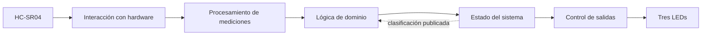
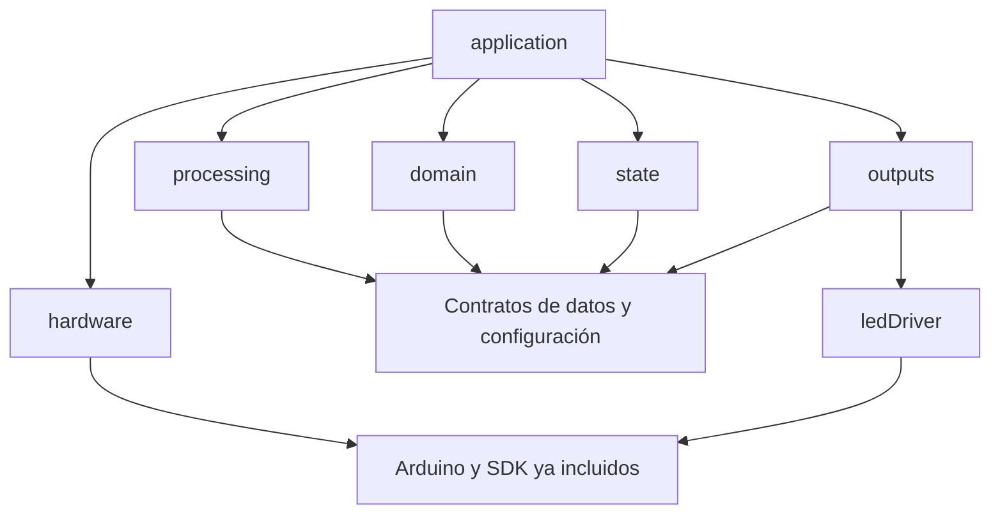
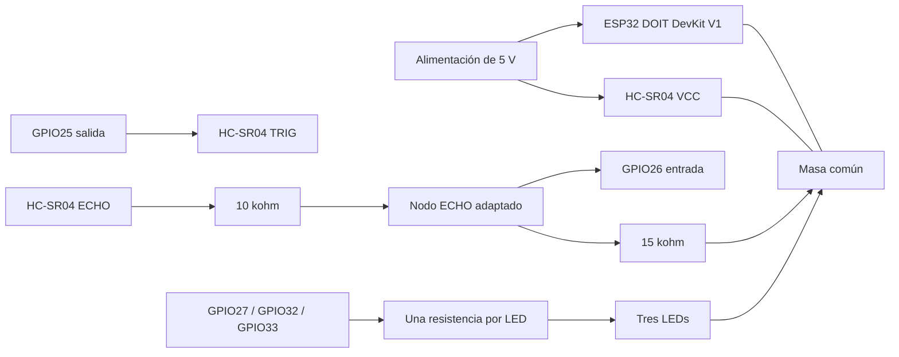

---
stepsCompleted: [step-01-validate-prerequisites, step-02-design-epics, step-03-create-stories, step-04-final-validation]
inputDocuments:
  - "_bmad-output/planning-artifacts/prds/prd-ultrasonic-proyect-iot-2026-09-06/prd.md"
  - "_bmad-output/planning-artifacts/architecture/architecture-ultrasonic-proyect-iot-2026-09-06/ARCHITECTURE-SPINE.md"
workflow: bmad-create-epics-and-stories
status: final
currentStep: complete
inputDocumentsConfirmed: true
requirementsExtracted: true
requirementsConfirmed: true
epicsConfirmed: true
storiesConfirmed: ["1.1", "1.2", "1.3", "1.4", "1.5", "1.6", "1.7", "1.8", "1.9", "2.1", "2.2", "2.3"]
readiness: PASS
approvalMode: user-authorized-completion-without-intermediate-pauses
updated: 2026-09-07
language: es
---

# ultrasonic proyect iot — Desglose de épicas e historias

## Resumen

Planificación completa: 2 épicas y 12 historias, con alcance y finalización autorizados por el usuario, criterios de aceptación y dependencias verificadas. Lista para generar seguimiento del sprint; todas las historias están pendientes de implementación. Se conservan los identificadores originales para trazabilidad. El PRD prevalece ante contradicciones.

Fuentes: [PRD](prds/prd-ultrasonic-proyect-iot-2026-09-06/prd.md) y [arquitectura](architecture/architecture-ultrasonic-proyect-iot-2026-09-06/ARCHITECTURE-SPINE.md).

Alcance: prototipo educativo radial ESP32/HC-SR04/tres LEDs; sin red, nube, ML, OTA, almacenamiento histórico ni interfaces adicionales. Se heredan S-01 a S-04: operador en interior controlado a 20–25 °C, sensor fijo, reflector plano de al menos 20 × 20 cm a 10–200 cm, alimentación estable y sin otros emisores ultrasónicos cercanos. No se garantiza identificación de objetos ni movimiento lateral a distancia radial constante.

## Inventario de requisitos

### Requisitos funcionales

RF-01: Medir periódicamente y registrar tiempo y validez de cada intento con espera acotada. Comportamiento: C-01. Aceptación: CA-01, CA-07.

RF-02: Rechazar datos inválidos y evitar que entren al filtro o simulen distancia cero. Comportamiento: C-01, C-03. Aceptación: CA-02, CA-07.

RF-03: Aplicar la mediana de tres y reconstruir el historial tras una interrupción. Comportamiento: C-01. Aceptación: CA-03, CA-08.

RF-04: Calcular variación y velocidad usando diferencias temporales reales, sin clasificar movimiento por proximidad. Comportamiento: C-02. Aceptación: CA-04, CA-05.

RF-05: Publicar estacionario, acercándose o alejándose según umbrales, signo y confirmación. Comportamiento: C-02. Aceptación: CA-04, CA-05, CA-06.

RF-06: Clasificar movimiento en intensidad baja, media o alta con histéresis. Comportamiento: C-02. Aceptación: CA-05, CA-06.

RF-07: Gestionar arranque, indisponibilidad y recuperación sin publicar información obsoleta. Comportamiento: C-03. Aceptación: CA-07, CA-08.

RF-08: Representar todos los estados e intensidades mediante los tres LEDs de §4. Comportamiento: C-04. Aceptación: CA-09.

RF-09: Permitir configurar los parámetros de §3 y rechazar combinaciones inválidas antes de adquirir. Comportamiento: §3, C-03. Aceptación: CA-10.

RF-10: Permitir aplicar calibración de distancia y umbrales y registrar el perfil usado en las pruebas. Comportamiento: §3, §8. Aceptación: CA-11.

Parámetros y comportamiento normativo del PRD, necesarios para detallar los criterios de las historias:

#### 3. Parámetros y reglas de configuración

[SUPUESTO S-02] Los siguientes valores son una configuración inicial propuesta, pendiente de calibración del montaje. Son normativos para las pruebas de referencia; cualquier ajuste debe quedar registrado y repetir las pruebas afectadas. No representan prestaciones ya medidas.

| Identificador camelCase | Inicial | Restricción verificable |
|---|---:|---|
| `samplePeriodMs` | 100 ms | Entre 80 y 200 ms; no disparar ráfagas para recuperar ciclos perdidos. |
| `sampleToleranceMs` | 10 ms | Mayor que cero y como máximo 10 % del período. |
| `echoTimeoutUs` | 25000 µs | Mayor que el tiempo de ida y vuelta para `maxDistanceCm`; menor que el período menos su tolerancia. |
| `minDistanceCm` / `maxDistanceCm` | 10 / 200 cm | 10 ≤ mínimo < máximo ≤ 200 cm para esta versión. |
| `distanceScale` / `distanceOffsetCm` | 1 / 0 cm | Escala finita entre 0,9 y 1,1; desplazamiento finito entre −5 y +5 cm. |
| `analysisLagSamples` | 5 | Entero de 3 a 8; separación nominal = valor × período. |
| `motionEnterCmPerSec` | 4 cm/s | Positivo y mayor que el umbral de salida. |
| `motionExitCmPerSec` | 2 cm/s | 0 ≤ salida < entrada. |
| `mediumEnterCmPerSec` / `mediumExitCmPerSec` | 12 / 10 cm/s | Entrada > salida > `motionEnterCmPerSec`. |
| `highEnterCmPerSec` / `highExitCmPerSec` | 25 / 22 cm/s | Entrada > salida > `mediumEnterCmPerSec`. |
| `confirmationCount` | 3 evaluaciones | Entero entre 2 y 5. |
| `invalidLimit` | 3 intentos | Entero entre 1 y 5. |
| `staleTimeoutMs` | 350 ms | Mayor que período + tolerancia; ≤ 1000 ms. |
| `lowBlinkHz` / `mediumBlinkHz` / `highBlinkHz` | 1 / 2 / 4 Hz | 0,5 ≤ baja < media < alta ≤ 5 Hz. |
| `statusBlinkHz` / `errorBlinkHz` | 1 / 2 Hz | Entre 0,5 y 5 Hz; patrones distinguidos también por combinación de LEDs. |

La mediana de tres y los límites del perfil operativo son decisiones de esta versión; modificar el tamaño del filtro o ampliar el rango requiere actualizar esta especificación. Todos los demás parámetros se agrupan en una configuración explícita, editable antes de compilar. No se exige edición en ejecución ni persistencia en memoria no volátil.

La validación rechaza valores no finitos, relaciones incompatibles, desbordamientos de tiempos o una configuración cuyo peor tiempo calculado de clasificación exceda 2 s. Ese cálculo incluye llenado del filtro, ventana temporal y confirmaciones. Los cambios se aplican tras reiniciar, sin mezclar muestras de configuraciones distintas. La asignación GPIO y polaridad LED son configurables y deben verificarse contra la placa real, sin compartir pines entre señales.

#### 4. Comportamiento del sistema

##### C-01. Adquisición y filtrado

Cada período se realiza como máximo una adquisición. Cada intento termina en una muestra válida o una causa de invalidez: sin eco, eco incompleto, plazo agotado, valor no finito o distancia fuera de rango. Se aplica la corrección `distanceScale × distancia + distanceOffsetCm` antes de validar el rango. Los extremos del rango son inclusivos.

Se calcula la mediana móvil de tres muestras válidas consecutivas; antes de reunirlas no existe distancia filtrada. Una muestra inválida corta el segmento y vacía el historial temporal y el filtro: nunca se inserta cero, la distancia máxima ni el último valor como sustituto. Un intervalo entre muestras fuera de período ± tolerancia también corta el segmento, pero la muestra actual, si es válida, puede iniciar uno nuevo. Los saltos aislados se atenúan con la mediana; un cambio sostenido dentro de rango debe conservarse, no eliminarse mediante un límite arbitrario de salto.

##### C-02. Estimación, confirmación y clasificación

Con `analysisLagSamples + 1` distancias filtradas consecutivas se calcula:

`radialVelocity = (filteredDistanceNow - filteredDistancePrevious) / elapsedSeconds`

`filteredDistancePrevious` es la salida separada por `analysisLagSamples` posiciones y `elapsedSeconds` usa sus tiempos efectivos reales. Tiempos nulos o no crecientes invalidan la evaluación e inician recuperación. Con el perfil inicial se necesitan ocho muestras crudas válidas para la primera evaluación; tres evaluaciones concordantes permiten publicar la primera clasificación en la décima muestra.

Las reglas utilizan la clasificación publicada como referencia:

1. Al iniciar o desde estacionario, se propone movimiento cuando el módulo es ≥ `motionEnterCmPerSec`; en otro caso se propone estacionario.
2. Desde movimiento, módulo ≤ `motionExitCmPerSec` propone estacionario. Dentro de la banda entre el umbral de salida del movimiento y el umbral de entrada se conserva la clasificación publicada, incluso si cambia el signo; no se declara una nueva dirección sin superar el umbral de entrada.
3. Desde movimiento, módulo ≥ entrada determina la dirección por el signo. Una inversión de dirección puede confirmarse directamente sin publicar un estacionario intermedio ficticio.
4. Al entrar en movimiento o cambiar dirección, intensidad alta si módulo ≥ entrada alta, media si ≥ entrada media, baja en otro caso. Mientras se mantiene la dirección: desde baja se asciende al cruzar entradas; desde media se baja si módulo ≤ salida media o se sube si ≥ entrada alta; desde alta se baja a baja si módulo ≤ salida media, a media si ≤ salida alta, y en otro caso se conserva alta. Se permiten saltos de nivel.
5. La pareja candidata (dirección, intensidad), o estacionario, debe repetirse `confirmationCount` evaluaciones consecutivas antes de publicarse. Una candidata distinta reinicia el contador a uno; una candidata igual al estado publicado cancela un cambio pendiente. Una invalidez borra toda confirmación pendiente.

##### C-03. Estados y recuperación

| Estado publicado | Entrada | Salida |
|---|---|---|
| Inicializando | Reinicio con configuración válida; sin historial. | Primera clasificación confirmada; o sin datos válidos al cumplirse una condición de fallo. |
| Estacionario | Candidata estacionaria confirmada. | Movimiento confirmado, recuperación o fallo. |
| Acercándose / alejándose | Pareja de dirección e intensidad confirmada. | Otra pareja o estacionario confirmado, recuperación o fallo. |
| Recuperando | Primer intento inválido o discontinuidad temporal desde un estado operativo. | Nueva clasificación confirmada con historial fresco; o sin datos válidos. |
| Sin datos válidos | `invalidLimit` intentos inválidos consecutivos o edad de última muestra válida ≥ `staleTimeoutMs`. Desde arranque, la edad se mide desde el inicio si no hubo muestra válida. | Primera muestra válida inicia recuperación; esta no publica movimiento hasta completar historial y confirmación. |
| Configuración inválida | Falla la validación al arranque. | Reinicio con configuración corregida. No se inicia adquisición. |

Prioridad: configuración inválida, sin datos válidos, inicialización/recuperación y finalmente clasificación operativa. La comprobación de caducidad se realiza aunque no termine un intento de medición. Cualquier estado no evaluable publica dirección e intensidad «no disponibles»; no conserva como vigente la última clasificación. El primer dato inválido durante inicialización conserva ese estado hasta que se cumpla la condición de fallo. Un dato válido reinicia el contador de inválidos consecutivos.

##### C-04. Retroalimentación visual

[SUPUESTO S-03] Se asignan roles por posición o etiqueta: `stationaryLed`, `approachingLed` y `recedingLed`. No se presupone disponer de colores específicos. El montaje debe permitir reconocer esos roles.

| Estado | Patrón de los tres LEDs |
|---|---|
| Estacionario | Solo `stationaryLed` encendido continuamente. |
| Acercándose | Solo `approachingLed` parpadea a 1, 2 o 4 Hz según intensidad baja, media o alta. |
| Alejándose | Solo `recedingLed` parpadea a 1, 2 o 4 Hz según intensidad. |
| Inicializando o recuperando | Solo `stationaryLed` parpadea a `statusBlinkHz`. |
| Sin datos válidos | Los tres parpadean sincronizados a `errorBlinkHz`. |
| Configuración inválida | Los tres encendidos continuamente. |

Todo parpadeo tiene ciclo de trabajo de 50 %. Al cambiar el estado o intensidad se inicia la fase encendida del nuevo patrón y se apagan los LEDs ajenos a él. Inicialización y recuperación comparten patrón porque ambas significan «esperando evidencia suficiente». Se necesita observar al menos un período completo para distinguir un LED fijo de uno intermitente. El parpadeo no detiene la adquisición.


### Requisitos no funcionales

RNF-01: Con el perfil inicial, iniciar adquisiciones cada 100 ± 10 ms durante 10 min y aplicar cambios LED en ≤ 20 ms desde una transición publicada. La adquisición no puede bloquear más de `echoTimeoutUs` + 2 ms. Aceptación: CA-01, CA-09.

RNF-02: Con perfil inicial y datos válidos continuos, clasificar desde arranque en ≤ 1,2 s y responder en ≤ 1,5 s a inicio, detención o inversión de las rampas constantes de CA-05/08. El límite no se aplica a estímulos que alternen candidatas sin completar la confirmación. Aceptación: CA-05, CA-08.

RNF-03: En 60 min de funcionamiento alternando fases válidas e inválidas no debe haber reinicios inesperados, bloqueos ni crecimiento monotónico de memoria. El incremento máximo de memoria dinámica retenida, respecto al final del arranque, será ≤ 1 KiB. Aceptación: CA-12.

RNF-04: La RAM reservada por buffers y estado propios de la aplicación será ≤ 8 KiB; firmware ≤ 80 % de la partición de aplicación seleccionada. No se crean buffers que crezcan con el tiempo. Aceptación: CA-12.

RNF-05: Implementar en C++ con identificadores propios camelCase, incluidos tipos y constantes; se exceptúan nombres impuestos por bibliotecas, macros o plataforma. Compilar sin advertencias atribuibles al código propio con `-Wall -Wextra`. Aceptación: CA-13.

RNF-06: Usar constantes con nombre y unidad para parámetros físicos/temporales, sin duplicar reglas de clasificación. No dejar código muerto ni estado global mutable salvo objetos necesarios de integración, documentados. Separar adquisición, análisis y LEDs mediante responsabilidades identificables y permitir probar el análisis con datos sintéticos sin hardware. Aceptación: CA-13.

RNF-07: Limitar funciones propias a 60 líneas no vacías y tres niveles de anidamiento; toda unidad tiene una responsabilidad descrita en una frase. Aplicar SRP y bajo acoplamiento sin exigir jerarquías ni clases donde basten funciones. Usar alcance y tipos explícitos, inicialización y gestión automática de recursos; evitar asignaciones dinámicas por muestra. Aceptación: CA-13.

RNF-08: Funcionar sin red ni servicios externos; no incorporar dependencias de ejecución adicionales al framework y herramientas ya necesarios para ESP32. Aceptación: CA-13.

### Requisitos adicionales

RT-01: Usar un ESP32, un HC-SR04 y tres LEDs. Alimentación, resistencias limitadoras, adaptación de nivel ECHO y cableado son elementos eléctricos necesarios, no nuevas funciones. Ningún GPIO debe recibir tensión o corriente fuera de los límites documentados del dispositivo. Aceptación: CA-14.

Base inicial: conservar el proyecto PlatformIO/Arduino existente; no se prescribe una plantilla nueva. La preparación inicial deberá fijar espressif32@7.1.1, C++17 y advertencias según arquitectura §10. Las versiones citadas son las documentadas en la fuente, no una nueva comprobación del entorno.

Las secciones siguientes conservan las decisiones AD-1 a AD-12, contratos y condiciones técnicas de la arquitectura. Son requisitos de implementación y verificación, no funciones adicionales. Se transcriben para evitar perder reglas al elaborar historias. Los nombres privados y disposición de archivos pueden ajustarse dentro de esos contratos. Las pruebas descritas siguen pendientes de ejecución.

#### 2. Paradigma y vista general

**Arquitectura por capas con procesamiento secuencial y bucle cooperativo.** Las responsabilidades se separan mediante módulos concretos y valores de datos. No se requieren un framework de aplicación, jerarquías de interfaces virtuales, inyección de dependencias mediante contenedor ni un bus de eventos.



La flecha de retorno transporta únicamente la clasificación publicada necesaria para aplicar la histéresis de C-02. El dominio no conoce la clase gestora de estados ni los LEDs. El orden causal es **medición → validación y filtrado → análisis temporal → detección → dirección e intensidad candidatas → confirmación y estado → LEDs**.

##### Responsabilidades y propiedad

| Capa / componente | Responsabilidad exclusiva | Estado que posee |
|---|---|---|
| Integración: `application` | Ejecutar el orden de cada iteración y coordinar reinicios de segmento. | Instancias de componentes; ninguna segunda copia autoritativa de clasificación. |
| Hardware: `monotonicClock` | Obtener tiempo monotónico en microsegundos. | Ningún historial de dominio. |
| Hardware: `ultrasonicDriver` | Generar TRIG, capturar ECHO y cerrar un intento con resultado o error. | Próximo disparo, fase de adquisición, plazos y un registro fijo de flancos. |
| Procesamiento: `measurementProcessor` | Convertir duración, corregir distancia, validar y producir mediana de tres. | Tres muestras crudas válidas del segmento y último tiempo de muestra. |
| Dominio: `temporalAnalyzer` | Comparar salidas filtradas separadas por la ventana configurada. | Historial circular de hasta nueve distancias filtradas. |
| Dominio: `classifyMotion` | Proponer dirección e intensidad conforme C-02. | Ninguno: función pura con clasificación publicada como entrada. |
| Estado: `systemState` | Aplicar confirmación, salud, prioridades y publicar una instantánea coherente. | Clasificación publicada, candidata pendiente, contador de confirmaciones, inválidos consecutivos y tiempos de salud. |
| Salidas: `ledController` | Traducir la instantánea a máscara y fase temporal de LEDs. | Estado/intensidad visual anterior y origen de fase. |
| Hardware de salida: `ledDriver` | Aplicar máscara lógica usando GPIO y polaridad. | Mapa eléctrico validado; opcionalmente última máscara escrita. |

La confirmación puede implementarse como funciones privadas de `systemState`; no exige una clase adicional. Las entidades anteriores expresan responsabilidades, no obligan a crear un archivo por función.

#### 3. Decisiones e invariantes

Los campos Binds, Prevents y Rule identifican respectivamente qué queda vinculado, qué divergencia se evita y la regla que debe cumplir el código. Los rótulos `[ADOPTED]` señalan decisiones ya fijadas por el usuario, el PRD o el proyecto.

##### AD-1 — Capas y dirección de dependencias [ADOPTED]

- **Binds — Vincula:** todos los componentes; RNF-05 a RNF-08.
- **Prevents — Evita:** clasificación ligada a GPIO, lógica de LEDs dentro del dominio y ampliación de alcance.
- **Rule — Regla:** procesamiento, dominio y estado solo usan C++ estándar y contratos comunes. Únicamente los adaptadores de hardware incluyen Arduino/ESP-IDF. `application` compone los módulos y llama sus operaciones. `ledController` no recibe distancias ni velocidades.



##### AD-2 — Propietario único y publicación coherente

- **Binds — Vincula:** `application`, `classifyMotion`, `systemState`, `ledController`; RF-05 a RF-08.
- **Prevents — Evita:** dos clasificaciones vigentes, confirmar dos veces o usar la candidata pendiente como referencia de histéresis.
- **Rule — Regla:** solo `systemState` muta el estado publicado y confirma candidatas. El dominio recibe una copia inmutable de la clasificación publicada operativa; durante inicialización o recuperación recibe ausencia de clasificación previa. La instantánea contiene estado, dirección e intensidad coherentes, y se copia completa hacia salidas en la misma iteración. El dominio nunca publica directamente.

##### AD-3 — Adquisición asíncrona mínima y ejecución cooperativa

- **Binds — Vincula:** adquisición, integración y sincronización; RF-01, RF-07, RNF-01.
- **Prevents — Evita:** una espera de eco de 25 ms que impida atender caducidad o salidas con plazo de 20 ms.
- **Rule — Regla:** un único `loop` de aplicación atiende adquisición, salud y LEDs sin esperar el eco. Una ISR GPIO captura exclusivamente flancos y tiempos del intento armado en un registro de capacidad uno. Se usa `attachInterruptArg` con contexto de instancia. No se crean tareas RTOS, colas ni timers con callbacks. La exclusión entre ISR y bucle se limita a copiar/actualizar ese registro; `volatile` por sí solo no basta. No hay clasificación, impresión, asignación de memoria ni esperas dentro de la ISR.

##### AD-4 — Contrato temporal común

- **Binds — Vincula:** todos los cálculos temporales; RF-01, RF-04, RF-07, RNF-01/02.
- **Prevents — Evita:** desbordamiento a los 32 bits, tiempos incompatibles entre capas o velocidad calculada con un período supuesto.
- **Rule — Regla:** `timeUs` representa microsegundos monotónicos en `std::int64_t`, obtenidos en hardware de `esp_timer_get_time()`. Todas las marcas de un arranque comparten origen. `sampleTimeUs` es el inicio real de TRIG; `completedAtUs` es el tiempo de cierre observado del intento. La continuidad y la velocidad usan `sampleTimeUs`; la caducidad usa la marca de adquisición de la última muestra válida, no el momento en que el bucle la leyó. La mediana conserva el tiempo cronológico de la muestra central, no el tiempo de la muestra que aportó el valor mediano. Tiempos no crecientes se tratan según C-02, sin generar velocidad. Reiniciar borra el historial completo.

##### AD-5 — Calidad del dato y segmento indivisible [ADOPTED]

- **Binds — Vincula:** `measurementProcessor`, `temporalAnalyzer`, reinicio de confirmaciones; RF-02 a RF-04.
- **Prevents — Evita:** movimiento inventado por ceros sustitutos, filtros que conservan muestras tras errores y filtros que eliminan cambios sostenidos.
- **Rule — Regla:** convertir duración positiva de eco a centímetros mediante la constante documentada `echoUsPerCm = 58.0F`; aplicar escala y desplazamiento del PRD antes de comprobar finitud y rango inclusivo. Usar solo mediana móvil de tres y la ventana de C-02. Una medición inválida borra filtro, historial temporal y confirmación. Una discontinuidad de tiempo hace lo mismo y permite que la muestra válida actual sea la primera del nuevo segmento. No añadir suavizados, normalizaciones o límites de salto adicionales.

##### AD-6 — Clasificación reproducible [ADOPTED]

- **Binds — Vincula:** `classifyMotion`, `systemState`; RF-04 a RF-06.
- **Prevents — Evita:** movimiento basado en proximidad, fronteras distintas entre dirección e intensidad y cambios prematuros.
- **Rule — Regla:** calcular `radialVelocityCmPerSec = deltaDistanceCm / elapsedSeconds` con tiempos efectivos reales. Implementar literalmente C-02: signo negativo acerca, positivo aleja; entrada inclusiva ≥, salida inclusiva ≤, bandas conservan la clasificación publicada; dirección nueva reinicia la evaluación de intensidad por entradas. La candidata completa debe repetirse `confirmationCount` veces. Igualar la publicada cancela un cambio pendiente; cambiar candidata reinicia el conteo a uno. No se añade una segunda histéresis ni confirmación en salidas.

##### AD-7 — Salud, prioridad y recuperación [ADOPTED]

- **Binds — Vincula:** `systemState` y orden de integración; RF-07.
- **Prevents — Evita:** presentar estacionario por falta de eco, reutilizar dirección anterior tras recuperación o contar una interrupción varias veces.
- **Rule — Regla:** seguir C-03 con prioridad configuración inválida → sin datos válidos → inicializando/recuperando → clasificación operativa. Cada intento cerrado actualiza salud exactamente una vez. La caducidad se evalúa en cada iteración aunque el sensor esté esperando. Un estado no evaluable expone dirección e intensidad no disponibles. El reinicio de segmento responde a invalidez, discontinuidad, entrada en caducidad o reinicio del sistema, no al mero cambio entre estados no evaluables. En particular, `noValidData → recovering` no borra la primera muestra fresca ya incorporada. Un dato válido reinicia inválidos consecutivos; solo si sigue fresco permite recuperar desde fallo, sin saltar la reconstrucción completa. Un dato válido caducado actualiza salud una vez con su marca original pero no entra en filtro ni produce recuperación transitoria.

##### AD-8 — Salidas derivadas del estado [ADOPTED]

- **Binds — Vincula:** `ledController`, `ledDriver`; RF-08.
- **Prevents — Evita:** patrones dependientes de distancia cruda, desfase acumulativo de parpadeo o LEDs antiguos encendidos.
- **Rule — Regla:** la única entrada de producto a `ledController` es `systemSnapshot`. Aplicar C-04; cada cambio de estado o intensidad reinicia fase encendida. La máscara lógica se calcula desde tiempo absoluto transcurrido respecto al origen de fase, no contando iteraciones. El controlador apaga todos los LEDs ajenos al patrón antes de encender los correspondientes. No utiliza `delay` para parpadear.

##### AD-9 — Configuración central e inmutable

- **Binds — Vincula:** configuración, adquisición, estado y salida; RF-09/10.
- **Prevents — Evita:** umbrales duplicados, división por cero, mezclar perfiles y escribir sobre pines de una configuración rechazada.
- **Rule — Regla:** `systemConfig` centraliza exactamente los parámetros del PRD §3; las constantes técnicas de conversión, pulso y capacidades tienen nombre y unidad. Validar antes de habilitar TRIG. El perfil permanece inmutable hasta reiniciar. Un mapa de arranque `safeBoardPins`, correspondiente al cableado verificado, permite representar configuración inválida sin aplicar un mapa GPIO solicitado que haya fallado validación. Nunca se escribe ni arma interrupción en un pin solicitado inválido. Los pines físicos seguros se validan al preparar el montaje, independientemente de los ensayos de configuración inválida.

##### AD-10 — Frontera eléctrica y mapa de montaje

- **Binds — Vincula:** hardware y adaptación de entrada/salida; RT-01.
- **Prevents — Evita:** 5 V sobre GPIO, LEDs sin limitación y acoplar el dominio a un pin físico.
- **Rule — Regla:** HC-SR04 alimentado a 5 V, masa común, ECHO adaptado al nivel del ESP32 y una resistencia en serie por LED. El mapa propuesto y el dimensionamiento de §5 deben verificarse mediante CA-14 antes de conectar ECHO al ESP32. No se presume tolerancia de GPIO a 5 V ni compatibilidad universal de módulos clonados. Cambiar cableado exige actualizar el perfil de placa y repetir su validación.

##### AD-11 — Recursos, C++ y pruebas desacopladas [ADOPTED]

- **Binds — Vincula:** todos los módulos; RNF-03 a RNF-08.
- **Prevents — Evita:** crecimiento de memoria, abstracciones sin propósito y depender de hardware para probar reglas numéricas.
- **Rule — Regla:** C++17, tipos propios, funciones, constantes y miembros en camelCase; `enum class`, inicialización explícita y `std::array` para almacenamiento acotado. Sin asignación dinámica por muestra ni buffers crecientes. No introducir excepciones como protocolo de errores; usar resultados tipados. La única instancia persistente de integración puede ser local estática en un punto de composición; `setup` y `loop` acceden a ella, y la ISR recibe su contexto explícito. Cumplir los límites de funciones, anidamiento, advertencias y memoria del PRD. El núcleo debe compilar en host sin Arduino.

##### AD-12 — Verificación y operación local [ADOPTED]

- **Binds — Vincula:** entrega, calibración y pruebas; RF-10, RNF-01 a RNF-08, RT-01.
- **Prevents — Evita:** declarar aceptación por compilación, añadir telemetría de producto o alterar silenciosamente umbrales para aprobar ensayos.
- **Rule — Regla:** verificar CA-01 a CA-14 con el perfil inicial y las reglas de recalibración del PRD. Registrar versiones, configuración y evidencia fuera del firmware. Compilación/carga local por el entorno PlatformIO existente; no OTA ni servicios. Una modificación de perfil reinicia el sistema y repite pruebas afectadas. Ningún resultado físico se da por obtenido en este documento.

#### 4. Contratos e interfaces

Los siguientes contratos fijan unidades, significado y propiedad. Son la estructura inicial de integración; los nombres de carpetas pueden evolucionar sin cambiar los contratos ni los AD.

| Tipo camelCase | Campos y semántica |
|---|---|
| `rawEchoResult` | `sampleTimeUs`, `completedAtUs`, `echoDurationUs` y `echoStatus`: `complete`, `noEcho`, `incompleteEcho` o `timedOut`. Duración solo utilizable con `complete`. |
| `distanceSample` | `distanceCm` finita y corregida; `sampleTimeUs` monotónico. Solo se construye como dato utilizable tras validar. |
| `processingResult` | `measurementStatus` (`valid`, `invalid`), `invalidReason` cuando corresponde, `segmentBroken`, `sampleFresh` y `std::optional<filteredSample>`. Incluye tiempo de muestra válida para actualizar salud aunque todavía no haya mediana. Validez física y frescura son datos separados. |
| `filteredSample` | `distanceCm` mediana; `sampleTimeUs` de la muestra cronológica central. |
| `velocityResult` | Estado `notReady`, `valid` o `invalidTime`; velocidad en cm/s solo en `valid`. |
| `motionClassification` | `direction`: `stationary`, `approaching` o `receding`; `intensity`: `none`, `low`, `medium` o `high`. Estacionario implica `none`; movimiento implica una de las otras tres. |
| `systemSnapshot` | `state`: `initializing`, `stationary`, `approaching`, `receding`, `recovering`, `noValidData` o `invalidConfiguration`; `std::optional<motionClassification> classification`. Solo los tres estados operativos contienen clasificación y deben coincidir con su dirección. |
| `ledMask` | Tres booleanos: `stationaryOn`, `approachingOn`, `recedingOn`. Sin números de GPIO, distancias ni dirección implícita. |

La ausencia de valor representa «no disponible», nunca cero ni un valor anterior. `std::optional` almacena el valor en el propio objeto, sin requerir heap. Los mensajes anteriores son retornos directos de funciones, no eventos enviados a una cola.

Las cabeceras comunes son la única definición de estos tipos: distancias y velocidades usan `float`; marcas temporales usan `timeUs`; duración de eco usa `std::uint32_t`; enumeraciones son `enum class` con base `std::uint8_t`; máscaras usan `bool`. Ningún módulo redefine su propia versión del mismo contrato. Convertir duraciones y unidades antes de operar, con comprobación de rango en los límites de entrada.

| Operación conceptual | Entrada → salida | Efectos permitidos |
|---|---|---|
| `ultrasonicDriver::service` | `nowUs` → opcional `rawEchoResult` | Gestiona un intento y GPIO; entrega cada resultado una sola vez. |
| `measurementProcessor::process` | resultado crudo, `sampleFresh` → `processingResult` | Valida siempre; actualiza filtro/continuidad solo con muestra válida fresca. Si no es fresca, vacía segmento y devuelve clasificación de validez sin salida filtrada. |
| `temporalAnalyzer::push` | `filteredSample` → `velocityResult` | Actualiza únicamente historial circular. |
| `classifyMotion` | velocidad, clasificación publicada opcional, configuración → candidata | Ninguno; función pura. |
| `systemState::onMeasurement` | validez, tiempo de muestra, frescura y ruptura de segmento | Actualiza salud y estado no evaluable una sola vez, priorizando caducidad sobre recuperación. No realiza conversión ni filtro. |
| `systemState::onCandidate` | candidata → instantánea consultable | Confirma y publica cuando corresponde. |
| `systemState::onTemporalDiscontinuity` | error temporal → estado no evaluable | Inicia recuperación, salvo que prevalezca configuración inválida o sin datos válidos; borra confirmación sin contar una segunda medición inválida. |
| `systemState::checkFreshness` | `nowUs` → indicador de transición | Aplica caducidad incluso sin mediciones completas. |
| `resetSegment` en integración | sin datos → componentes vacíos | Coordina `reset` de filtro, historial y confirmación; no borra salud salvo en reinicio total. |
| `ledController::update` | instantánea, `nowUs` → `ledMask` | Actualiza fase; sin acceso al sensor. |
| `ledDriver::write` | máscara → GPIO | Aplica polaridad/mapa eléctrico. |

`invalidReason` distingue ausencia/eco incompleto/plazo, dato no finito y fuera de rango para pruebas internas. No atribuye causa física como «sensor desconectado». No se requiere una consola para exponerlo.

#### 5. Arquitectura de hardware



| Señal / rol | Propuesta | Condición de montaje |
|---|---|---|
| `triggerPin` | GPIO25, salida, reposo bajo | Pulso alto `triggerPulseUs = 10`; confirmar respuesta del TRIG real a 3,3 V. |
| `echoPin` | GPIO26, entrada sin pull-up a 5 V | Recibir únicamente la señal adaptada. |
| `stationaryLedPin` | GPIO27 | LED por resistencia hacia masa, activo alto como perfil inicial. |
| `approachingLedPin` | GPIO32 | Igual conexión, identificado por posición/etiqueta. |
| `recedingLedPin` | GPIO33 | Igual conexión, identificado por posición/etiqueta. |

Estos GPIO son de entrada/salida en ESP32 clásico y evitan los pines de flash y los de entrada exclusiva. La exposición de la placa física se verifica antes del montaje. La polaridad puede cambiar por configuración, preservando los roles lógicos.

**Adaptación ECHO propuesta:** resistencia superior de 10 kΩ entre ECHO y nodo, resistencia inferior de 15 kΩ entre nodo y GND, ambas de 1 %. La división nominal es `5 × 15 / (10 + 15) = 3,0 V`. Esta cuenta es un dimensionamiento inicial, no garantía del nivel alto real del módulo. Medir nivel alto y bajo en el nodo y contrastarlos con los límites VIH/VIL y máximos de la hoja de datos del ESP32 alimentado realmente. La ficha genérica del HC-SR04 no fija todos los valores VOH/VOL de los clones.

**LEDs:** seleccionar cada resistencia mediante `resistanceOhm ≥ (gpioHighVoltage - ledForwardVoltage) / ledCurrentAmp`, con datos del LED concreto, tolerancias y límites GPIO. Como punto inicial de montaje puede evaluarse 1 kΩ por LED; CA-14 confirma corriente y CA-09 visibilidad. No se exige un color ni corriente de producto nuevos.

Usar una alimentación de 5 V estable compatible con la entrada de la placa y el sensor, y masa común. Documentar la ruta de alimentación real; no conectar dos fuentes de 5 V entre sí sin verificar el diseño de la placa. El HC-SR04 no se alimenta desde una salida GPIO. Si el módulo no acepta el TRIG disponible o no entrega niveles utilizables, la validación del montaje queda pendiente; no se incorpora automáticamente otro módulo o hardware fuera del PRD.

El mapa de arranque seguro debe corresponder al montaje real y mantener TRIG bajo. Primero se inicializan esos LEDs; después se valida la configuración solicitada. Ante un mapa solicitado duplicado o no permitido se conservan los LEDs seguros encendidos y no se habilita adquisición. El mapa seguro no es un segundo conjunto de umbrales ni un perfil de calibración; es la definición eléctrica mínima de la placa. Una placa mal cableada no puede diagnosticarse ni repararse por software.

#### 6. Adquisición y planificación temporal

##### Ciclo del sensor

El controlador tiene fases internas `idle`, `waitingRise`, `waitingFall` y `completed`. No son nuevos estados visibles del producto. Un intento comienza como máximo una vez por período. Antes de armarlo, TRIG está bajo y ECHO debe estar bajo; ECHO ya alto produce un intento inválido con eco incompleto, sin simular distancia.

Se arma el registro bajo sección crítica, se fecha el inicio de TRIG y se genera el pulso alto de 10 µs. Ese pulso corto es la única espera activa prevista en la aplicación. La ISR de cambio de nivel acepta el primer ascenso y el primer descenso posterior del intento; después ignora otros flancos. El bucle valida orden y plazo y calcula duración fuera de la ISR.

El plazo absoluto es `sampleTimeUs + echoTimeoutUs`, incluyendo toda la espera desde el disparo. Sin ascenso al vencer: `noEcho`; ascenso sin descenso: `incompleteEcho`; par de flancos completado fuera de plazo: `timedOut`. Un par completo con descenso exactamente en el plazo se admite. Al consultar el registro se decide usando los tiempos capturados: un eco completado en plazo no se rechaza solo porque el bucle lo leyó más tarde. Se desarma al cerrar el intento; el registro se vacía antes del próximo. No existen varios intentos simultáneos ni resultados acumulados.

Secciones críticas compartidas entre ISR y bucle protegen copia coherente de marcas de 64 bits, fase y banderas. Se usan las primitivas ya incluidas en el framework; no se crean tareas propias. La ISR y las llamadas que haga deben verificarse contra la configuración de interrupciones del framework instalado; no se presume que un atributo por sí solo haga todo el código residente en IRAM.

##### Bucle y orden de servicio

1. Leer `nowUs`. Comprobar caducidad de la última muestra válida; si cambia a no evaluable, reiniciar segmento y actualizar LEDs inmediatamente.
2. Atender adquisición: cerrar el intento pendiente o iniciar uno si venció su período y no hay otro activo. Como máximo un inicio por iteración. Planificar el siguiente desde el inicio real actual más `samplePeriodMs`; nunca recuperar períodos perdidos en ráfaga.
3. Si hay resultado, calcular una sola vez `sampleFresh` con el reloj actual: edad no negativa y estrictamente menor que `staleTimeoutMs`. Pasar esa bandera al procesador y a salud. Procesar el resultado una vez. Ante ruptura, reiniciar historial temporal y confirmación; el procesador ya ha reiniciado su filtro y, si corresponde, conservado la muestra válida fresca actual como primera del segmento. No llamar después a un reinicio que vuelva a perder esa muestra.
4. Actualizar salud con `onMeasurement`. Si hay salida filtrada y estado habilitado para recuperación/análisis, calcular velocidad y candidata; `systemState` aplica confirmación. Un error temporal reinicia segmento e inicia recuperación sin publicar velocidad.
5. Volver a leer el reloj, comprobar caducidad y aplicar la instantánea a LEDs antes de terminar la iteración.

Ante caducidad y un resultado válido que llegan a la misma iteración, primero se reconoce la caducidad y se corta el segmento. El resultado se admite únicamente si su propia marca sigue fresca; inicia recuperación. Esto impide reactivar movimiento con un resultado retenido demasiado tiempo. `invalidLimit` cuenta resultados de medición inválidos, no iteraciones de espera ni rupturas de tiempo con muestra válida.

Si el eco es válido pero `sampleFresh` es falso, se registra una medición válida a efectos de salud: reinicia el contador de inválidos y actualiza la última marca válida únicamente si es posterior a la registrada. No se rejuvenece esa marca usando el tiempo de lectura. El segmento permanece vacío, no hay candidata y el estado queda `noValidData` por caducidad, sin pasar transitoriamente por recuperación. Así se consume el intento exactamente una vez sin equiparar «válido» con «todavía utilizable». La próxima muestra válida fresca es la primera del segmento; nueve más concordantes completan la primera publicación del perfil inicial.

El presupuesto interno de diseño es atender servicios al menos cada 1 ms en operación normal, con secciones críticas breves. Es una asignación de margen para cumplir RNF-01 y CA-09, no una prestación nueva al usuario. No hay espera de 25 ms, impresión por muestra ni llamadas de red. El cumplimiento real de período 100 ± 10 ms y latencia LED ≤ 20 ms se mide: no se deriva exclusivamente del uso de interrupciones.

##### Ventana y latencia

Con filtro de tres, retardo de `L = analysisLagSamples` posiciones y `C = confirmationCount`, la primera evaluación requiere `L + 3` muestras válidas y la primera publicación concordante `L + C + 2`. Para L=5 y C=3 resultan ocho y diez muestras, respectivamente. La fórmula asume estímulos concordantes del PRD; no promete confirmar una candidata que cambia continuamente.

Para validar un perfil se utiliza una cota conservadora de arranque/ventana/confirmación:

`classificationBoundMs = (L + C + 2) × (samplePeriodMs + sampleToleranceMs) + echoTimeoutUs / 1000 + 2 + 20`

Los términos finales reservan cierre de adquisición y actualización de salida según los límites del PRD. Los valores se representan mediante constantes con nombre en código. Perfil inicial: 1147 ms, dentro de 1,2 s para arranque y 2 s de configuración. La respuesta a inicio/parada/inversión debe comprobarse además con CA-05/08; esta cuenta no sustituye sus ensayos de rampas ni demuestra rendimiento físico. Rechazar perfiles cuya cota supere 2000 ms o cuyos cálculos desborden.

#### 7. Procesamiento, dominio y estado

##### Procesamiento de mediciones

La duración se convierte mediante `distanceCm = echoDurationUs / echoUsPerCm`. Después se aplica `distanceScale × distanceCm + distanceOffsetCm` y se valida el rango inclusivo 10–200 cm del perfil inicial. El factor 58 proviene de la ficha del sensor; escala/desplazamiento absorben correcciones de calibración previstas por el PRD, sin sensor térmico.

Las tres muestras se conservan en orden temporal. La mediana ordena una copia local de tres valores; no reordena sus tiempos en el historial. Se comprueba continuidad con el intervalo real entre marcas de disparo y la tolerancia configurada. Un dato inválido no ocupa una posición. Una interrupción elimina todo el segmento; no se interpola, extrapola ni sustituye por la última distancia.

`temporalAnalyzer` almacena un máximo de nueve salidas filtradas, suficiente para el máximo L=8 del PRD. Con al menos L+1, resta la salida actual y la situada L posiciones atrás. El delta temporal se convierte explícitamente de microsegundos a segundos antes de dividir. Distancia absoluta no interviene en el clasificador.

##### Clasificación y confirmación

Con el perfil inicial: movimiento entra a módulo ≥4 cm/s y sale a ≤2; media entra a ≥12 y sale a ≤10; alta entra a ≥25 y sale a ≤22. Se conserva la clasificación publicada dentro de la banda de movimiento 2–4, aunque cambie el signo. Para igual dirección, las bandas de intensidad siguen C-02; para nueva dirección se elige intensidad por umbrales de entrada. No se publica un estacionario artificial entre direcciones.

La comparación de candidatas incluye dirección e intensidad. Desde estado no evaluable, tres candidatas iguales del perfil inicial publican la primera clasificación. Una inválida borra la candidata pendiente. Las fronteras se evalúan sin un épsilon añadido: las pruebas ±0,01 de CA-06 validan el comportamiento numérico.

##### Estado público

| Condición | Resultado y acción |
|---|---|
| Configuración rechazada | `invalidConfiguration`; sin TRIG; todos los LEDs encendidos. |
| Inicio con configuración válida | `initializing`; historial vacío, clasificación ausente. |
| Candidata confirmada | Estado operativo coincidente y clasificación disponible. |
| Primer inválido o ruptura desde operativo | `recovering`; clasificación ausente, segmento nuevo. |
| Inválido durante inicialización, sin alcanzar fallo | Conservar `initializing`, borrar segmento/candidata. |
| Tercer inválido consecutivo o edad ≥350 ms, perfil inicial | `noValidData`; clasificación ausente. |
| Primer válido fresco desde `noValidData` | `recovering`; iniciar historial nuevo. |
| Confirmación tras reconstrucción | Publicar clasificación sin reutilizar referencia anterior al fallo. |

La salud se actualiza con cada muestra válida aun sin haber mediana; la primera mediana no determina cuándo el sensor volvió a dar datos. Mientras no haya ninguna muestra válida, la referencia de caducidad es el inicio del sistema. Los contadores de confirmación e invalidez se saturan en sus límites para evitar desbordamiento.

#### 8. Control de LEDs

La tabla C-04 del PRD es normativa. Estacionario: solo su LED fijo. Acercándose o alejándose: solo el LED de dirección a 1/2/4 Hz según baja/media/alta. Inicializando y recuperando: solo estacionario a `statusBlinkHz`. Sin datos válidos: los tres sincronizados a `errorBlinkHz`. Configuración inválida: los tres fijos.

Para un patrón intermitente, calcular `halfPeriodUs = 1000000 / (2 × frequencyHz)`. La fase está encendida cuando el número entero de semiperíodos desde `phaseStartUs` es par. Al cambiar estado o intensidad, actualizar `phaseStartUs` y escribir fase encendida inmediatamente; si no cambia, conservarlo. Reiniciar fase cuando se pasa entre inicialización y recuperación aunque compartan patrón, como exige C-04.

`ledDriver` traduce encendido lógico a nivel físico según polaridad. Actualizar una máscara completa evita conservar LEDs ajenos al patrón. La pequeña separación entre escrituras GPIO no implica una nueva clasificación; CA-09 verifica sincronía, frecuencia, ciclo 50 % y transición ≤20 ms. La adquisición continúa mientras parpadea.

#### 9. Configuración y calibración

La lista exhaustiva de parámetros de producto reside en PRD §3: período/tolerancia, timeout, rango, escala/desplazamiento, ventana, umbrales de movimiento e intensidad, confirmaciones, límite de inválidos, caducidad, frecuencias, GPIO y polaridad. `systemConfig` mantiene sus nombres y valores iniciales. Ningún componente contiene una copia alternativa de esos valores.

Separar constantes técnicas con nombre (`filterSampleCount`, `maxFilteredSamples`, `triggerPulseUs`, `echoUsPerCm`, `microsecondsPerSecond`) de parámetros de calibración. No son controles nuevos para el operador. Validar todas las relaciones del PRD, finitud, capacidades, tipos y operaciones temporales, incluidos tiempo de ida/vuelta del rango máximo y cota de §6. La validación es una función comprobable sin hardware, más validación del mapa eléctrico antes de usar GPIO.

Calibración manual conforme PRD §8: 100 muestras válidas en 20/100/180 cm, error de mediana ≤2 cm y validez ≥95 %; ruido estático durante 60 s con percentil 99 por debajo del umbral de salida; movimientos ±6/16/30 cm/s con intensidades baja/media/alta. Registrar perfil, versiones, placa, módulo, montaje y resultados en el informe de pruebas. No crear un modo automático de calibración, interfaz de comandos ni persistencia de parámetros en el producto.

Editar perfil, recompilar y reiniciar para aplicar ajustes. Repetir fronteras parametrizadas y ensayos afectados sin degradar las metas físicas del PRD. Una calibración fallida no se oculta aumentando umbrales hasta dejar de detectar 6 cm/s.

#### 10. Entorno tecnológico y estructura inicial

| Elemento | Versión / estado verificado |
|---|---|
| Lenguaje propio | C++17, decisión de compilación para esta implementación. |
| Plataforma PlatformIO `espressif32` | 7.1.1 instalada; `platformio.ini` actual aún no fija versión. |
| Arduino-ESP32 | 2.0.17 instalado; paquete `3.20017.241212+sha.dcc1105b`. |
| ESP-IDF transitivo del framework | 4.4.7 instalado; no se añade como segundo framework. |
| Compilador Xtensa | GCC 8.4.0, paquete `8.4.0+2021r2-patch5`. |
| Placa | `esp32doit-devkit-v1` existente. |

Son versiones observadas localmente, no una afirmación de que sean las últimas disponibles. Para implementar, conservar esta base y fijar `espressif32@7.1.1`; registrar las versiones resueltas de paquetes. Seleccionar `-std=gnu++17` eliminando el estándar anterior y habilitar `-Wall -Wextra` para el código propio. Verificar el comando efectivo de compilación. No se actualiza ni se instala software en este trabajo documental.

```text
include/
  systemConfig.h       configuración y validación declarada
  measurementTypes.h   contratos de medición y tiempo
  systemTypes.h        clasificación, estado y máscara lógica
src/
  main.cpp             setup/loop y composición
  application.cpp      orden de servicio y reinicio coordinado
  hardware/            reloj, ultrasonicDriver, ledDriver
  processing/          measurementProcessor
  domain/              temporalAnalyzer, classifyMotion
  state/               systemState y confirmación
  outputs/             ledController
test/
  host/                análisis, estado, temporización con reloj simulado
  target/              comprobaciones específicas de placa e instrumentación
```

Cabeceras correspondientes junto a sus módulos cuando no sean contratos compartidos. No se exige una biblioteca externa de pruebas: un ejecutable host con verificaciones explícitas y código de salida no cero basta. Las pruebas host no requieren compilar `hardware`; los adaptadores se verifican mediante sus contratos en placa y, donde proceda, con un registro de flancos simulado. El entorno host concreto puede utilizar un compilador C++17 disponible, sin convertirlo en dependencia de ejecución del producto.

#### 11. Recursos y operación

| Área | Diseño y evidencia |
|---|---|
| Filtro | Tres muestras de tamaño fijo; copia local de tres valores para mediana. |
| Ventana | Nueve salidas filtradas como máximo; índice/tamaño acotados. |
| Captura | Un registro de flancos, sin lista creciente ni cola. |
| Estado y LEDs | Instancias únicas y contadores acotados; sin historial de operación. |
| RAM de aplicación | Suma de buffers, instancias, configuración y auxiliares ≤8 KiB; comprobar `sizeof` y mapa de enlace, incluyendo padding. |
| Memoria dinámica | Sin asignaciones por muestra; CA-12 mide memoria retenida real, incluido comportamiento del entorno. |
| Flash | Imagen ≤80 % de la partición de aplicación realmente seleccionada; no calcular contra toda la flash de la placa. |
| Ejecución | Una tarea de aplicación del framework existente; ninguna tarea propia adicional. ISR corta solo para captura. |

No se reservan buffers para historiales, red o telemetría. Se reutilizan valores y estructuras locales; no se introduce optimización por plantillas ni punto fijo sin evidencia de necesidad. El uso de `float` para distancias/velocidades y enteros de 64 bits para tiempo debe superar CA-05/06; no se usa `float` para acumular tiempo de ejecución.

Entornos: host para lógica y placa física para integración/aceptación. Despliegue local por PlatformIO y conexión de programación de la placa; aplicación autónoma después del arranque. La calibración viaja dentro del firmware compilado. No hay proveedor de infraestructura, base de datos, autenticación ni operación remota que diseñar. Ante pérdida de alimentación se reinicia en inicialización; no se recupera un historial anterior.

#### 12. Estrategia de pruebas y trazabilidad

Las siguientes pruebas se planifican; no han sido ejecutadas sobre una implementación. El PRD conserva la especificación exacta de cada CA y sus reglas para el perfil calibrado.

| Requisito PRD | Responsable / decisión | Verificación |
|---|---|---|
| RF-01 | `ultrasonicDriver`, reloj, AD-3/4 | CA-01 y CA-07: intervalos, timeout y caducidad mientras espera. |
| RF-02 | `measurementProcessor`, AD-5 | CA-02/07: extremos, no finitos y ecos inválidos sin sustitutos. |
| RF-03 | Filtro y reinicio coordinado, AD-5 | CA-03/08: pico aislado, cambio sostenido y recuperación. |
| RF-04 | `temporalAnalyzer`, AD-4/6 | CA-04/05: posiciones fijas, rampas y tiempo real 90/110 ms. |
| RF-05 | `classifyMotion` y `systemState`, AD-2/6 | CA-04/05/06: signo, bandas y confirmación. |
| RF-06 | `classifyMotion`, AD-6 | CA-05/06: intensidad, fronteras e histéresis. |
| RF-07 | `systemState`, AD-7 | CA-07/08: no evaluable, prioridad y reconstrucción. |
| RF-08 | `ledController`, `ledDriver`, AD-8 | CA-09: matriz completa de estados, fases y GPIO. |
| RF-09 | `systemConfig`, mapa seguro, AD-9 | CA-10: perfiles válidos/incorrectos, sin TRIG inválido. |
| RF-10 | Configuración y calibración, AD-9/12 | CA-11: registro reproducible y límites físicos. |
| RNF-01 | Planificación e ISR, AD-3/4/8 | CA-01/09: medición de jitter, salida y bloqueo. |
| RNF-02 | Ventana y confirmación, AD-4/6 | CA-05/08: 8/10 muestras y latencias del perfil. |
| RNF-03 | Estado y almacenamiento fijo, AD-7/11 | CA-12: 60 min alternando datos válidos y ausencia de eco. |
| RNF-04 | Buffers e imagen, AD-11 | CA-12: mapa de memoria, heap y partición. |
| RNF-05 | C++17 y contratos, AD-1/11 | CA-13: camelCase y advertencias propias. |
| RNF-06 | Propiedad y separación, AD-1/2/11 | CA-13: constantes, duplicación y pruebas sin GPIO. |
| RNF-07 | Módulos y funciones, AD-11 | CA-13: ≤60 líneas, ≤3 niveles, SRP y asignaciones. |
| RNF-08 | Entorno existente, AD-11/12 | CA-13: dependencias y operación sin red. |
| RT-01 | Montaje y adaptadores, AD-10 | CA-14: niveles eléctricos, corriente y mapa real. |

Orden de comprobación: validación de configuración y lógica pura; integración con tiempo simulado; compilación de placa; inspección eléctrica; pruebas físicas; ensayo de 60 min. Las pruebas de tiempo simulado cubren eco justo en plazo/fuera de plazo, caducidad sin cierre, llegada de dato fresco después del fallo, ruptura que conserva la muestra actual y cruce de 2³² microsegundos. Esos casos concretan CA-07/08, no añaden estados de producto.

Para LEDs, comparar máscaras y fases con reloj simulado y después medir los GPIO con el sensor activo. Para la ISR, comprobar transferencia atómica y cierre único con flancos/invalidez; el reloj simulado no prueba latencia real de interrupciones. Para memoria, incluir tamaño de objetos y lectura periódica durante el ensayo. La instrumentación de prueba no obliga a entregar logs, puertos de comandos o almacenamiento de producto.

#### 13. Decisiones, compromisos y riesgos

Esta sección explica las elecciones solicitadas por el usuario; los AD anteriores son el contrato de implementación y el registro `.memlog.md` conserva su procedencia.

| Elección | Alternativa considerada | Compromiso y riesgo verificable |
|---|---|---|
| ISR breve y bucle cooperativo | Espera bloqueante de eco | Una ISR exige sincronizar un registro, pero permite atender el límite de 20 ms mientras transcurre el timeout de 25 ms. CA-01/07/09 verifican el resultado. |
| Registro fijo de un intento | Tareas, colas o periférico de captura más complejo | Capacidad suficiente para un sensor y una adquisición por período. No hay procesamiento concurrente; si se pierde un plazo, se invalida/reconstruye según PRD. |
| Funciones y componentes concretos | Interfaces virtuales para cada operación | Menos estructura; la comprobabilidad proviene del núcleo sin hardware y de entradas temporales explícitas. CA-13 confirma desacoplamiento. |
| Mediana tres y diferencia temporal | Suavizados adicionales o ML | Conserva exactamente el PRD. Cambios de reflector persistentes pueden parecer movimiento; no se garantiza identidad de objeto. |
| Tiempo de 64 bits | Reloj de 32 bits y aritmética modular distribuida | Algo más de almacenamiento y copia atómica, con un solo contrato temporal y prueba de cruce. |
| Perfil compilado | Configuración persistente/interfaz en ejecución | Requiere recompilar para calibrar; evita funciones de producto no solicitadas. |
| Preservar versiones instaladas | Migrar al framework más reciente | Reduce cambios respecto al proyecto. No implica garantizar ausencia de defectos del framework; CA-12/13 y registro de versiones condicionan aceptación. |

Riesgos heredados: ecos múltiples, blanco lateral, ruido, temperatura y montaje. Se mantienen el entorno S-04 y los ensayos del PRD. Riesgos de implementación: pérdida de flanco, sección crítica demasiado larga, perfil temporal demasiado agresivo o mapa eléctrico incorrecto. Se resuelven con resultados inválidos/recuperación y verificación correspondiente, sin afirmar una causa física específica ni ocultar fallos.

La cota de configuración es conservadora y puede rechazar perfiles lentos aunque sus campos individuales estén dentro de rango; el PRD ya exige la condición conjunta de ≤2 s. Caducidades muy próximas al período pueden producir recuperación durante un eco todavía en curso: se conserva la semántica de edad del PRD y se verifica el perfil, sin relajar silenciosamente el plazo.

#### 14. Decisiones diferidas y condiciones de cierre

| Pendiente de implementación o montaje | Responsable / condición | Límite ya fijado |
|---|---|---|
| Identificar variante real HC-SR04 y LEDs; confirmar mapa y resistencias | Montaje, antes de conectar y CA-14 | RT-01 y AD-10; la propuesta de §5 no certifica componentes desconocidos. |
| Validar `safeBoardPins` contra cableado real | Montaje/firmware, antes de energizar y CA-10/14 | LEDs de error independientes de un mapa solicitado rechazado; sin TRIG inválido. |
| Valores calibrados | Pruebas/firmware, CA-11 | Parámetros y metas físicas del PRD, sin nueva interfaz. |
| Verificar tiempos ISR/bucle y recursos reales | Firmware, CA-01/09/12 | Presupuestos del PRD; no sustituir medición por estimación. |
| Disposición final de archivos y utilidades privadas | Implementador al escribir código | Se pueden ajustar sin romper capas, propietarios, contratos o AD. |
| Compilador host e instrumentación concreta | Pruebas, antes de CA-13 | C++17; cero dependencias de ejecución nuevas en el producto. |

No hay una decisión funcional pendiente: comportamiento, contratos y límites vienen del PRD. La validación eléctrica y física sí es una condición previa a la aceptación del montaje y del firmware. Finalizar este documento habilita la implementación; no declara aprobado el producto.


Calibración, aceptación y métricas extraídas del PRD (CA-01 a CA-14):

#### 8. Calibración y puesta en servicio

1. Registrar placa, módulo, GPIO, polaridad de LEDs, alimentación, adaptación de nivel, versión del firmware, temperatura aproximada y configuración. Confirmar RT-01 antes de energizar el conjunto conectado.
2. Con el reflector inmóvil a 20, 100 y 180 cm, obtener 100 muestras válidas por posición. Ajustar escala/desplazamiento si es necesario dentro de §3. Tras el ajuste, exigir error de la mediana respecto a la referencia ≤ 2 cm y al menos 95 % de lecturas válidas por posición. Si no se cumple, revisar montaje y módulo; no declarar calibración aprobada.
3. En cada posición registrar 60 s de velocidad filtrada. Medir el percentil 99 de su módulo; debe quedar por debajo del umbral de salida. Si no, corregir montaje o ajustar umbrales dentro de §3 y repetir toda la aceptación de sensibilidad y latencia. El ajuste no puede eliminar la detección a 6 cm/s.
4. Ejecutar recorridos de referencia en ambas direcciones a 6, 16 y 30 cm/s. Confirmar baja, media y alta, respectivamente. Los umbrales revisados deben conservar esas clasificaciones en el perfil aceptado.
5. Archivar resultados y configuración en un informe de pruebas del proyecto. El registro puede realizarse por instrumentación de prueba o depurador; no obliga a incluir consola, pantalla, almacenamiento o telemetría en el producto.

Recalibrar tras cambiar sensor, montaje, alimentación o perfil. Si una calibración no alcanza los criterios, se registra como fallida y se corrige o se revisa explícitamente el PRD; no se sustituyen los límites de aceptación silenciosamente.

#### 9. Criterios de aceptación y método de prueba

Las pruebas de lógica inyectan muestras y tiempos en el análisis sin requerir un segundo sensor. Las físicas usan marcas de distancia, referencia temporal y observación/medición de los GPIO. Registrar entrada, estado, intensidad, tiempo y resultado esperado/obtenido. La instrumentación se limita a la verificación y no amplía funcionalidades del producto.

Los números de las pruebas temporales y de frontera corresponden al perfil inicial. Tras calibrar, repetirlas sustituyendo fronteras por los parámetros efectivos y conservando pruebas de igualdad y ±0,01 cm/s. Recalcular períodos, caducidad y número de muestras con §3, y documentar límites de latencia del perfil final, siempre ≤ 2 s. Los objetivos físicos de ruido, error, recorridos a 6/16/30 cm/s y sus clasificaciones se conservan. CA-10 sigue incluyendo el perfil inicial y el perfil alternativo indicado.

| ID | Procedimiento y resultado exigido |
|---|---|
| CA-01 | Medir 10 min de adquisiciones bajo datos válidos y ausencia de eco por separado: todos los intervalos dentro de 100 ± 10 ms; espera individual ≤ 27 ms; ningún disparo de recuperación en ráfaga. |
| CA-02 | Inyectar 10 y 200 cm: válidos. Inyectar 9,99; 200,01; cero; negativo; NaN; infinito; eco ausente e incompleto: inválidos. No aumentan el tamaño del historial ni generan velocidad. |
| CA-03 | Inyectar 100, 100, 180, 100, 100 cm a 100 ms: las tres medianas son 100 cm. Inyectar después suficientes valores constantes de 120 cm: la salida alcanza 120 cm tras dos muestras nuevas; no queda bloqueada en 100 cm. |
| CA-04 | Inyectar por separado 20, 100 y 180 cm constantes durante 10 s: tras inicialización todas las evaluaciones publicadas son estacionario. En prueba física, tras 2 s de asentamiento, cero transiciones a movimiento durante 60 s en cada posición de calibración. |
| CA-05 | Inyectar rampas a ±6, ±16 y ±30 cm/s durante 3 s, dentro de rango: dirección correcta y baja/media/alta en el 100 % de evaluaciones tras 1,5 s. Repetir con intervalos alternos de 90 y 110 ms, construyendo distancia con el tiempo real; error de velocidad ≤ 0,1 cm/s. Realizar 10 recorridos físicos por combinación, de ≥ 3 s, velocidad de referencia ±10 %: al menos 9 de 10 alcanzan dirección/intensidad correctas dentro de 1,5 s y las conservan el resto del recorrido. |
| CA-06 | En el clasificador, entrada exacta de 4 cm/s durante tres evaluaciones produce movimiento; 3,99 desde estacionario no. Desde movimiento, un módulo de velocidad de 2 cm/s produce estacionario tras tres evaluaciones; 2,01 cm/s conserva movimiento. Probar ascensos en 12 y 25, descensos en 10 y 22, y valores ±0,01 de cada frontera. Una candidata distinta durante solo una o dos evaluaciones no cambia el estado. Alternar 11,9/12,1 partiendo de baja y 24,9/25,1 partiendo de media durante 20 evaluaciones: sin cambio. Invertir signo con módulo 6: nueva dirección tras tres evaluaciones. |
| CA-07 | Desde movimiento, un inválido produce recuperando y valores no disponibles en ≤ 20 ms tras cerrar el intento. Tres inválidos consecutivos producen sin datos válidos en el tercer intento. Sin intentos completados, edad de 350 ms produce ese estado en ≤ 20 ms adicionales. En ningún caso aparece estacionario como sustituto. Repetir desde arranque sin eco. |
| CA-08 | Desde encendido, ocho muestras válidas de una rampa constante de CA-05 o distancia fija producen primera evaluación y diez producen primera publicación; total ≤ 1,2 s con perfil inicial. Desde fallo, repetir con diez válidas consecutivas del mismo estímulo: primera muestra inicia recuperación y décima permite clasificar, sin reutilizar historial anterior. Un intervalo de 150 ms reinicia historial. Probar reposo → rampa, rampa → reposo y rampa → rampa de signo opuesto para cada módulo 6/16/30 cm/s; mantener cada fase ≥ 3 s, dentro de rango: publicación correcta ≤ 1,5 s desde el cambio. Simular cruce del contador temporal de plataforma: sin tiempos negativos, falsos fallos ni bloqueo. |
| CA-09 | Forzar cada estado y las seis combinaciones dirección/intensidad: GPIO coinciden con C-04; frecuencia y ciclo de trabajo con error ≤ 10 %, LEDs ajenos apagados. Observar cada patrón por ≥ 4 s. Cambio de patrón ≤ 20 ms; continuar cumpliendo CA-01 mientras parpadea. |
| CA-10 | Compilar y ejecutar perfil inicial y un perfil válido distinto (por ejemplo entrada/salida 5/3 cm/s): cambia la frontera de clasificación. Probar salida ≥ entrada, NaN, período de 50 ms, rango invertido, GPIO repetidos y latencia calculada > 2 s: estado configuración inválida, sin disparos TRIG. |
| CA-11 | Completar todos los pasos de §8: errores ≤ 2 cm, validez ≥ 95 %, percentil 99 de ruido bajo umbral de salida, CA-04 y recorridos CA-05 aprobados. Informe identifica perfil y montaje reproducibles. |
| CA-12 | Ejecutar 60 min alternando 30 s con reflector válido y 30 s sin eco: cero reinicios/bloqueos, recuperación automática conforme CA-08. Medir memoria cada minuto; crecimiento retenido ≤ 1 KiB y sin tendencia creciente. Informe de compilación/mapa confirma buffers/estado ≤ 8 KiB y firmware ≤ 80 % de partición. |
| CA-13 | Compilar para el entorno declarado con advertencias habilitadas; inspeccionar código propio y dependencias: cumplir cada condición RNF-05 a RNF-08. Ejecutar CA-02 a CA-08 sobre lógica desacoplada de GPIO. Registrar evidencia de nombres, límites de funciones, responsabilidades, constantes y ausencia de duplicación/estado innecesario. |
| CA-14 | Inspeccionar esquema y montaje; medir ECHO en el pin ESP32 y corrientes de LEDs. Cumplir límites de hoja de datos de la placa/chip y LEDs concretos; documentar alimentación, masa común, limitación de corriente y adaptación de nivel necesaria. No conectar ECHO de 5 V directamente a GPIO de 3,3 V. |

#### 10. Éxito y cierre de aceptación

| Métrica | Objetivo y trazabilidad |
|---|---|
| ME-01: clasificación útil | ≥ 90 % de recorridos físicos correctos por combinación, según CA-05; RF-04 a RF-06. |
| ME-02: rechazo de falso movimiento | Cero transiciones durante cada ensayo estacionario de 60 s, CA-04; RF-03 y RF-05. |
| ME-03: respuesta | Límites de RNF-01/02 y CA-07 satisfechos; RF-01, RF-07 y RF-08. |
| ME-04: continuidad | CA-12 aprobado; RNF-03/04. |

ME-02 contrapesa la sensibilidad de ME-01; ME-03 impide ocultar ruido con un filtrado excesivamente lento. No se acepta mejorar una sacrificando otra. La aceptación exige aprobar **todos** los CA aplicables al perfil final, adjuntar evidencias reproducibles y no mantener incumplimientos abiertos. Un PRD finalizado no equivale a producto aceptado.

Las tablas de §5 y §6 constituyen la matriz de trazabilidad requisito → comportamiento → aceptación (para restricciones, el comportamiento está contenido en el propio requisito). Las métricas anteriores añaden la relación con el resultado del producto.


### Requisitos de diseño UX

No hay contrato UX separado. La interfaz de tres LEDs ya está definida por RF-08/C-04/CA-09 y AD-8: roles por posición o etiqueta, patrones por estado, frecuencia por intensidad, fase inicial encendida y actualización temporal. No se añaden colores obligatorios, aplicación, pantalla ni requisitos UX-DR nuevos.

### Mapa de cobertura de requisitos

| Requisito | Épica responsable | Resultado cubierto |
|---|---|---|
| RF-01 | 1 | Adquisición periódica con resultado, tiempo y espera acotada. |
| RF-02 | 1 | Rechazo de datos inválidos sin sustituirlos por distancias ficticias. |
| RF-03 | 1 | Mediana de tres y reconstrucción del segmento. |
| RF-04 | 1 | Velocidad radial con tiempos reales, independiente de proximidad. |
| RF-05 | 1 | Reposo y dirección confirmados. |
| RF-06 | 1 | Intensidad baja/media/alta con histéresis. |
| RF-07 | 1 | Arranque, indisponibilidad y recuperación sin clasificación obsoleta. |
| RF-08 | 1 | Todos los estados e intensidades visibles mediante LEDs. |
| RF-09 | 1 | Perfil compilado validado y rechazo seguro de configuración inválida. |
| RF-10 | 2 | Calibración aplicada y perfil reproducible con resultados registrados. |

| Restricción / aceptación | Cobertura y responsabilidad |
|---|---|
| RNF-01, RNF-02 | Épica 1 implementa y comprueba adquisición, caducidad, respuesta y LEDs con perfil inicial; épica 2 repite pruebas afectadas por calibración. |
| RNF-03, RNF-04 | Épica 1 implementa almacenamiento acotado y comprueba presupuesto de imagen/RAM; épica 2 ejecuta CA-12 completo, incluido ensayo de 60 min, memoria cada minuto y recursos del firmware final. |
| RNF-05 a RNF-08 | Épica 1 aplica C++17, estilo, responsabilidades, pruebas host y operación sin red desde el inicio; épica 2 registra conformidad del firmware final y repite CA-13 si cambia. |
| RT-01 | Épica 1 identifica componentes y valida montaje mediante CA-14 antes de conectar y operar; épica 2 conserva evidencia y repite si cambia el montaje. |
| AD-1 a AD-11 | Épica 1 establece capas, contratos, adquisición, tiempo, estado, salidas, configuración, frontera eléctrica y recursos. Épica 2 los conserva durante calibración. |
| AD-12 | Épica 1 aporta comprobaciones host/placa y evidencia del perfil inicial; épica 2 integra la evidencia de aceptación del perfil final. |
| CA-01 a CA-10, CA-13, CA-14 | Épica 1 cubre los ensayos del comportamiento inicial y montaje; las exigencias físicas no se sustituyen por pruebas simuladas. Épica 2 repite las afectadas y consolida aceptación final. |
| CA-11, CA-12 | Épica 2 completa calibración y operación sostenida con evidencias reproducibles. |

RF-10 utiliza los parámetros editables y validadores entregados por RF-09; esto es una dependencia hacia la épica anterior, no una segunda implementación de configuración. Ninguna restricción de seguridad, recursos o calidad se pospone para permitir incumplimientos en la épica 1.

## Lista de épicas

### Épica 1: Observar el movimiento radial y reconocer cuándo la lectura no es fiable

El operador puede encender un montaje verificado y distinguir reposo, acercamiento, alejamiento e intensidad mediante los tres LEDs. También reconoce inicialización, recuperación, ausencia de datos y configuración inválida, sin interpretar un fallo como reposo ni conservar una clasificación obsoleta.

**Requisitos funcionales:** RF-01 a RF-09.

**Entrega:** recorrido completo sensor → procesamiento → clasificación y estado → LEDs con perfil inicial, configuración validada, montaje documentado y pruebas de comportamiento. Incluye integración real y evidencia host/placa para CA-01 a CA-10, CA-13 y CA-14. La planificación de historias mantendrá los criterios completos de esos CA.

**Notas de implementación:** conservar la base PlatformIO/Arduino y preparar C++17/versiones/advertencias dentro de esta épica. Respetar AD-1 a AD-11 y la verificación local de AD-12. La captura de eco, el estado y los LEDs forman una función integrada; se descompondrán en historias acotadas y ordenadas, sin dependencias hacia historias futuras. Los patrones de fallo y la validación eléctrica forman parte de esta entrega.

**Dependencias:** ninguna épica previa o futura. El montaje físico validado es condición para las pruebas con hardware y debe resolverse aquí. La calibración completa y el ensayo prolongado se entregan en la épica 2; cerrar esta épica no declara aceptado todo el producto.

### Épica 2: Calibrar el montaje y demostrar funcionamiento estable y reproducible

El responsable del prototipo puede ajustar el perfil a su montaje y entregar evidencia de precisión, sensibilidad, respuesta y estabilidad. El operador recibe un sistema con perfil identificado que supera todos los criterios de aceptación aplicables, sin sacrificar detección de movimiento para ocultar ruido.

**Requisito funcional principal:** RF-10. Revalida RF-01 a RF-09 cuando se ajusta el perfil.

**Entrega:** procedimiento e informe de calibración con 100 muestras válidas en 20/100/180 cm, error ≤2 cm, validez ≥95 %, ruido estático por debajo del umbral de salida y recorridos ±6/16/30 cm/s conforme CA-04/05/11. Ensayo CA-12 de 60 min alternando 30 s válidos/sin eco, sin reinicios ni bloqueos, con medición de memoria cada minuto; incremento retenido ≤1 KiB, RAM propia ≤8 KiB e imagen ≤80 % de la partición de aplicación. Registro de montaje, perfil, versiones, entradas y resultados; cierre de CA-01 a CA-14 aplicables al perfil final sin incumplimientos abiertos.

**Notas de implementación:** usar la configuración compilada de la épica 1; ajustar, recompilar y reiniciar según PRD §8. Repetir fronteras y latencias parametrizadas y las pruebas afectadas; conservar las metas físicas y los perfiles exigidos por CA-10. La instrumentación y los informes son de verificación y no añaden telemetría ni interfaces al producto. Aplicar AD-9/12 y preservar los demás contratos.

**Dependencias:** épica 1 completada, montaje disponible e instrumentos de verificación. No depende de una épica posterior. Si un ensayo falla, registrar y corregir la causa o tramitar un cambio explícito de requisitos; no declarar aceptación ni relajar límites silenciosamente.

**Justificación del agrupamiento:** dos resultados distintos: observar movimiento con comportamiento completo y aceptar un montaje calibrado para uso sostenido. La primera épica concentra el firmware que comparte los mismos componentes. La segunda delimita la incertidumbre física de calibración y estabilidad; su trabajo principal es el perfil y la evidencia, con correcciones de firmware solo si las pruebas lo requieren. No se crean épicas separadas por capas técnicas.

## Epic 1: Observar el movimiento radial y reconocer cuándo la lectura no es fiable

El operador distingue reposo, dirección, intensidad y estados no evaluables en un montaje verificado. Cobertura: RF-01 a RF-09, RNF-01 a RNF-08, RT-01 y AD-1 a AD-12 según el mapa anterior. Las historias se incorporan en orden de dependencia; la épica solo se completa con el recorrido físico integrado y sus pruebas.

### Story 1.1: Comprobar el perfil de medición antes de utilizarlo

Como responsable del firmware,
quiero compilar reproduciblemente y validar el perfil de medición sin conectar el sensor,
para detectar parámetros incompatibles antes de utilizarlos en el montaje.

**Estado de planificación:** aprobada por el usuario; pendiente de implementación.

**Dependencias:** ninguna historia anterior. Parte del proyecto PlatformIO/Arduino existente; no requiere adquisición, clasificación ni LEDs implementados.

**Trazabilidad:** RF-09 (configuración y validación pura); RNF-05 a RNF-08; AD-1, AD-9 y AD-11; arquitectura §§6, 9 y 10. Cubre la parte de validación de CA-10 y la compilación/inspección de las unidades creadas según CA-13. La indicación de configuración inválida, ausencia de TRIG y cambio efectivo de clasificación entre perfiles se verificarán en historias posteriores de integración; no se declaran cubiertos por esta historia.

**Alcance:** configuración central, resultado tipado de validación, compilación objetivo y ejecutable host de pruebas. Solo crear los tipos y archivos necesarios para ese recorrido; no anticipar todo el dominio ni escribir GPIO. El perfil de placa admite la comprobación lógica de pines; la validación eléctrica del montaje seguirá siendo obligatoria antes de conectar hardware.

**Criterios de aceptación:**

**Dado** el proyecto para `esp32doit-devkit-v1` con framework Arduino,
**Cuando** se compila el cambio mediante PlatformIO,
**Entonces** se fija `espressif32@7.1.1`, se selecciona `-std=gnu++17` retirando el estándar anterior y se habilitan `-Wall -Wextra`,
**Y** se registra el comando efectivo y las versiones resueltas; el código propio incorporado compila sin advertencias y conserva el framework existente.

**Dado** el perfil inicial del PRD §3,
**Cuando** se construye `systemConfig`,
**Entonces** contiene una única definición de todos los parámetros con sus nombres, unidades y valores iniciales: período/tolerancia 100/10 ms, timeout 25000 µs, rango 10/200 cm, escala/desplazamiento 1/0, retardo 5, umbrales movimiento 4/2, media 12/10, alta 25/22 cm/s, confirmaciones 3, inválidos 3, caducidad 350 ms y frecuencias baja/media/alta 1/2/4 Hz y estado/error 1/2 Hz,
**Y** incluye GPIO y polaridad configurables; separa las constantes técnicas nombradas de filtro, capacidades, conversión y pulso, y el perfil se consume inmutable.

**Dado** un perfil candidato,
**Cuando** se ejecuta la validación sin Arduino ni hardware,
**Entonces** se verifican todas las restricciones y relaciones del PRD §3: finitud, período 80–200 ms, tolerancia positiva ≤10 % del período, timeout mayor que el tiempo de ida/vuelta para la distancia máxima y menor que período menos tolerancia, rango 10 ≤ mínimo < máximo ≤200 cm, escala 0,9–1,1, desplazamiento −5 a +5 cm, retardo entero 3–8, confirmaciones 2–5, inválidos 1–5, caducidad mayor que período+tolerancia y ≤1000 ms,
**Y** se comprueban las relaciones de todos los umbrales, frecuencias baja < media < alta dentro de 0,5–5 Hz y frecuencias de estado/error dentro de 0,5–5 Hz; los límites inclusivos se conservan y los perfiles inválidos devuelven un resultado tipado con causa comprobable.

**Dado** un mapa de GPIO solicitado,
**Cuando** se valida contra las capacidades de la placa objetivo,
**Entonces** se rechazan pines repetidos, inexistentes o incompatibles con el rol y pines reservados no permitidos por el perfil de placa,
**Y** la función no configura pines ni arma interrupciones, y no interpreta un mapa lógicamente válido como prueba de cableado o niveles eléctricos correctos.

**Dado** un perfil cuyos campos individuales están dentro de rango,
**Cuando** se calcula la cota `(L+C+2) × (samplePeriodMs+sampleToleranceMs) + echoTimeoutUs/1000 + 2 + 20`,
**Entonces** se evitan desbordamientos antes de realizar las operaciones y se rechazan cotas mayores de 2000 ms,
**Y** el perfil inicial produce 1147 ms y es válido; un perfil con período 200 ms, tolerancia 20 ms, L=8 y C=5 se rechaza por su cota aunque sus campos individuales sean admisibles.

**Dado** un ejecutable host C++17 que usa el mismo validador de producción,
**Cuando** se ejecutan pruebas del perfil inicial, del alternativo con entrada/salida 5/3 cm/s y de perfiles inválidos,
**Entonces** los dos primeros son aceptados y se rechazan salida ≥ entrada, NaN, infinito, período 50 ms, rango invertido, GPIO duplicados, frecuencias incompatibles y cota >2 s,
**Y** se prueban límites válidos e inmediatamente fuera de rango de cada familia de parámetros, incluyendo timeout/caducidad; cualquier comprobación fallida termina con código distinto de cero y quedan documentados los comandos para repetirla sin GPIO.

**Dado** el cambio terminado,
**Cuando** se inspeccionan las unidades incorporadas,
**Entonces** usan identificadores propios camelCase, inicialización explícita, constantes con nombre/unidad, resultados tipados y responsabilidades descritas; cada función tiene ≤60 líneas no vacías y ≤3 niveles de anidamiento,
**Y** no duplican parámetros ni requieren red, nuevas dependencias de ejecución o asignaciones dinámicas para validar; el ejecutable host es instrumentación de prueba y no una interfaz del producto.

### Story 1.2: Obtener distancias filtradas sin ocultar errores de medición

Como responsable de verificar el prototipo,
quiero procesar secuencias de ecos y comprobar cuáles producen distancias filtradas utilizables,
para evitar que los errores de lectura y los picos aislados generen evidencia falsa de movimiento.

**Estado de planificación:** aprobada por el usuario; pendiente de implementación.

**Dependencias:** historia 1.1 para configuración validada, compilación y ejecutable host. Se verifica con entradas sintéticas, sin requerir controlador físico de adquisición, analizador de velocidad, gestor de estado ni LEDs.

**Trazabilidad:** RF-02 y RF-03 en procesamiento; RF-04 en conservación de tiempos; AD-1, AD-4, AD-5 y contrato `measurementProcessor::process` de arquitectura §4; RNF-04 a RNF-08. Cubre CA-02/03 y la ruptura/reconstrucción del filtro de CA-08. La publicación de estados, reinicio del historial temporal y confirmaciones y las latencias físicas se comprobarán en historias de dominio/integración; no forman parte del cierre de esta unidad.

**Alcance:** contratos de medición necesarios, conversión/corrección/validación y mediana móvil de tres en `measurementProcessor`, con pruebas host del código de producción. La frescura llega como entrada explícita calculada por integración; el procesador informa validez y ruptura sin gestionar salud ni volver a calcular la frescura.

**Criterios de aceptación:**

**Dado** un `rawEchoResult` completo con duración positiva y un perfil validado,
**Cuando** se procesa la medición,
**Entonces** se calcula `distanceCm = echoDurationUs / echoUsPerCm` con `echoUsPerCm = 58.0F`, se aplica escala y desplazamiento una sola vez y después se comprueban finitud y rango inclusivo,
**Y** se conservan por separado `sampleTimeUs` (inicio real de TRIG) y `completedAtUs` (cierre); las marcas usan `timeUs` de 64 bits con origen común, sin fechar la muestra con el momento de consumo.

**Dado** el perfil inicial y un punto de prueba para la función de validación de distancia usada por producción,
**Cuando** se inyectan 10 y 200 cm, luego 9,99, 200,01, cero, negativos, NaN e infinito,
**Entonces** solo los dos extremos válidos son aceptados,
**Y** se prueban por separado ecos completos de 580 y 11600 µs y perfiles con corrección que muevan una distancia hacia dentro o fuera del rango; las pruebas de flotantes no dependen de redondear los casos a duraciones enteras de eco.

**Dado** un filtro parcialmente lleno o con salida disponible,
**Cuando** llega `noEcho`, `incompleteEcho`, `timedOut`, duración cero o una distancia inválida,
**Entonces** se devuelve `measurementStatus=invalid`, causa tipada, `segmentBroken=true` y ausencia de salida filtrada, y se vacía el filtro y su referencia de continuidad,
**Y** no se inserta cero, distancia máxima ni último valor; las siguientes dos muestras válidas frescas todavía no producen mediana y la tercera sí.

**Dado** un segmento nuevo con muestras válidas frescas cada 100 ms,
**Cuando** se suministran 100, 100, 180, 100 y 100 cm,
**Entonces** las dos primeras muestras no producen salida y las tres siguientes producen medianas de 100 cm,
**Y** al continuar con valores de 120 cm la salida alcanza 120 cm tras dos muestras nuevas; no se aplica otro suavizado ni un límite arbitrario de salto que elimine cambios sostenidos.

**Dado** un trío cronológico de distancias 100, 180 y 100 cm en tiempos 0, 100000 y 200000 µs,
**Cuando** se genera su mediana,
**Entonces** el resultado vale 100 cm y su `sampleTimeUs` es 100000 µs, correspondiente a la posición cronológica central,
**Y** ordenar una copia de valores no reordena el historial ni atribuye el tiempo del elemento que aportó el valor mediano.

**Dado** un segmento activo con el perfil inicial,
**Cuando** los intervalos son exactamente 90 o 110 ms,
**Entonces** se conserva continuidad,
**Y** intervalos de 89999 µs, 110001 µs o 150 ms, así como marcas iguales o decrecientes, cortan el segmento; si la muestra actual es válida y fresca se conserva como primera del nuevo filtro, informa ruptura y no produce mediana hasta incorporar otras dos consecutivas. El reinicio no duplica ni pierde esa primera muestra.

**Dado** un resultado físicamente válido con `sampleFresh=false`,
**Cuando** el procesador lo consume,
**Entonces** informa validez física y marca original para salud, conserva `sampleFresh=false`, indica ruptura, vacía el segmento y no entrega salida filtrada,
**Y** la próxima muestra válida fresca empieza un segmento nuevo; se prueba también un resultado físicamente inválido no fresco para comprobar que frescura no sustituye la validación física. La decisión de mantener `noValidData` pertenece al gestor de estado.

**Dado** el procesador y su ejecutable host,
**Cuando** se repiten las pruebas anteriores con marcas que atraviesan 2^32 µs y secuencias largas,
**Entonces** se mantienen resultados y continuidad sin truncamientos a 32 bits, el filtro conserva como máximo tres muestras y no crece memoria por muestra,
**Y** se documenta el tamaño de almacenamiento propio aportado al presupuesto total de 8 KiB, compila en host sin Arduino y para placa sin advertencias propias, cumple RNF-05 a RNF-08 y cualquier fallo de prueba devuelve código no cero.

### Story 1.3: Estimar movimiento radial con tiempo real e histéresis

Como responsable de verificar el prototipo,
quiero obtener velocidad radial y candidatas de dirección e intensidad a partir de distancias filtradas,
para comprobar que el movimiento depende de la variación temporal y conserva las bandas de estabilidad definidas.

**Estado de planificación:** aprobada por el usuario; pendiente de implementación.

**Dependencias:** historias 1.1 y 1.2 para configuración, contratos de medición y pruebas host. La clasificación publicada de referencia se suministra explícitamente en las pruebas; no requiere gestor de estado, controlador del sensor ni LEDs.

**Trazabilidad:** RF-04 y parte de RF-05/06; AD-1, AD-2, AD-4, AD-5, AD-6 y AD-11; RNF-04 a RNF-08. Cubre el cálculo y candidatas de CA-04/05/06 y la ventana temporal de CA-08. La confirmación de tres candidatas, publicación, recuperación y respuesta integrada permanecen para la historia del gestor de estado y la integración. Los ensayos físicos no se sustituyen por estos resultados host.

**Alcance:** `temporalAnalyzer`, `velocityResult`, `motionClassification` y la función pura `classifyMotion`, conforme contratos de arquitectura §4. El analizador posee solo la ventana; el clasificador recibe velocidad, configuración y clasificación publicada opcional. No confirma ni muta estado publicado, y no accede a GPIO.

**Criterios de aceptación:**

**Dado** un segmento nuevo con retardo L validado,
**Cuando** se incorporan salidas filtradas consecutivas,
**Entonces** el analizador devuelve `notReady` hasta reunir L+1 salidas y después calcula `(distanciaActual - distanciaDeHaceLPosiciones) / segundosRealesTranscurridos`,
**Y** utiliza los tiempos efectivos de las muestras filtradas y no el período nominal; con L=5 y el filtro de la historia 1.2 la primera velocidad aparece en la octava muestra cruda válida.

**Dado** el perfil inicial y distancias constantes de 20, 100 o 180 cm durante 10 s,
**Cuando** cada secuencia se procesa de manera independiente,
**Entonces** toda velocidad disponible es cero y toda candidata sin referencia previa o con referencia estacionaria es estacionario con intensidad `none`,
**Y** cambiar la distancia constante entre ensayos no produce una dirección por proximidad.

**Dado** rampas dentro de rango a ±6, ±16 y ±30 cm/s durante al menos 3 s,
**Cuando** se calculan las distancias usando tiempos reales, con intervalos de 100 ms y después alternando 90/110 ms,
**Entonces** cada velocidad disponible tras llenar la ventana tiene error ≤0,1 cm/s y cada candidata desde ausencia de clasificación previa tiene signo correcto e intensidad baja/media/alta respectivamente,
**Y** la entrada negativa propone acercamiento y la positiva alejamiento; las pruebas documentan las entradas y resultados esperados sin afirmar publicación ni latencia física.

**Dado** ausencia de clasificación previa o referencia estacionaria,
**Cuando** el módulo cruza la entrada de movimiento,
**Entonces** 3,99 cm/s propone estacionario y 4 cm/s propone movimiento, con signo determinado por la velocidad,
**Y** desde una referencia en movimiento, módulo ≤2 propone estacionario y 2 < módulo <4 conserva la pareja publicada de dirección e intensidad incluso si cambia el signo; se verifican 1,99/2/2,01 y 3,99/4/4,01 en ambos signos y referencias pertinentes.

**Dado** entrada en movimiento o inversión respecto a una dirección publicada,
**Cuando** el módulo es ≥4 cm/s,
**Entonces** la candidata toma la dirección del signo y asigna alta si módulo ≥25, media si ≥12 y baja en otro caso,
**Y** una inversión con módulo 6 propone directamente la dirección nueva con intensidad baja, incluso si la referencia anterior era alta; no se genera un estacionario intermedio ni se hereda histéresis de intensidad de la dirección abandonada.

**Dado** que se mantiene la dirección y el módulo está en la región de movimiento ≥4 cm/s,
**Cuando** se propone intensidad a partir de la clasificación publicada,
**Entonces** desde baja se asciende a media en ≥12 y alta en ≥25; desde media se baja a baja en ≤10 o se sube a alta en ≥25; desde alta se baja a baja en ≤10, a media en ≤22 y se conserva alta por encima de 22,
**Y** se prueban igualdad y ±0,01 cm/s en 10, 12, 22 y 25, los saltos directos entre baja/alta y ambas direcciones; la región inferior de movimiento sigue las reglas del criterio anterior, sin añadir un épsilon numérico.

**Dado** una clasificación publicada suministrada como valor inmutable,
**Cuando** se invoca repetidamente `classifyMotion` con iguales entradas o con secuencias alternantes de velocidades,
**Entonces** la función devuelve candidatas reproducibles sin memoria interna, contadores de confirmación ni cambios de la referencia recibida,
**Y** el analizador solo entrega velocidades válidas al clasificador; `notReady` e `invalidTime` representan ausencia de velocidad y no se convierten en cero ni en una candidata estacionaria.

**Dado** un analizador con historial,
**Cuando** se recibe una marca temporal igual o decreciente,
**Entonces** se informa `invalidTime` sin velocidad utilizable; la integración deberá reiniciar el segmento y notificar la discontinuidad al estado,
**Y** la operación explícita de reinicio deja el analizador vacío: tras reiniciarlo no reaparece ninguna velocidad anterior y se necesitan L+1 nuevas salidas filtradas. Se prueba el reinicio con ventana parcial y completa, sin depender de un gestor de estado futuro.

**Dado** los retardos mínimo L=3 y máximo L=8, además del inicial L=5,
**Cuando** se procesan suficientes muestras para recorrer varias veces la ventana circular y cruzar 2^32 µs,
**Entonces** la referencia usada está exactamente L posiciones atrás, la capacidad máxima es nueve muestras filtradas y los cálculos temporales conservan 64 bits,
**Y** las pruebas host del código de producción pasan con código cero, la compilación objetivo no introduce advertencias propias, se registra la contribución de memoria al presupuesto de 8 KiB y se cumplen RNF-05 a RNF-08 sin asignaciones dinámicas por muestra.

### Story 1.4: Publicar una clasificación confirmada y retirar datos obsoletos

Como operador,
quiero que la clasificación solo sea vigente con evidencia suficiente y reciente,
para distinguir movimiento confirmado de inicialización, pérdida de datos y recuperación.

**Dependencias:** 1.1, 1.2 y 1.3. **Trazabilidad:** RF-05/06/07; AD-2/6/7; CA-06/07/08 en lógica host; RNF-05 a RNF-08.

**Alcance:** `systemState` y `systemSnapshot` con tiempo y mediciones inyectados; la salida observable de esta historia es la instantánea, sin GPIO. Solo este componente confirma y publica. La integración física se completa posteriormente.

**Criterios de aceptación:**

**Dado** un arranque con configuración válida,
**Cuando** se consulta la instantánea,
**Entonces** el estado es `initializing` sin clasificación; con configuración rechazada es `invalidConfiguration`,
**Y** la prioridad es configuración inválida → sin datos válidos → inicializando/recuperando → operativo. Los estados no evaluables nunca contienen dirección/intensidad anteriores; estacionario contiene intensidad `none` y movimiento una intensidad válida.

**Dado** una secuencia de candidatas,
**Cuando** la misma pareja dirección/intensidad o estacionario se repite tres veces con perfil inicial,
**Entonces** se publica en la tercera; una candidata distinta reinicia el contador a uno y una igual a la publicada cancela el cambio pendiente,
**Y** una o dos candidatas distintas no cambian la publicación, invertir signo a módulo 6 confirma la nueva dirección sin reposo intermedio y una invalidez borra toda confirmación pendiente. Se prueba también `confirmationCount` 2 y 5 y saturación del contador.

**Dado** movimiento publicado,
**Cuando** se registra el primer intento inválido,
**Entonces** pasa inmediatamente a `recovering` sin clasificación; el tercero consecutivo produce `noValidData`,
**Y** una medición válida reinicia el contador de inválidos, cada intento actualiza salud una sola vez y las iteraciones sin resultado o rupturas con muestra válida no incrementan ese contador. Durante inicialización un inválido conserva `initializing` hasta alcanzar fallo. Se prueban límites de inválidos 1, 3 y 5 sin desbordar contadores.

**Dado** la última marca válida o el inicio si aún no hubo datos,
**Cuando** `checkFreshness` recibe edad 349999 y después 350000 µs con perfil inicial,
**Entonces** solo al alcanzar el límite produce `noValidData`, incluso sin intentos completados,
**Y** la marca utilizada es la de adquisición y no el momento de lectura. Un válido caducado actualiza salud con su marca original solo si posterior, reinicia inválidos y mantiene `noValidData` sin recuperación transitoria.

**Dado** `noValidData`,
**Cuando** llega el primer válido fresco,
**Entonces** pasa a `recovering` sin clasificación y espera nuevas candidatas concordantes; no reutiliza clasificación previa como referencia de histéresis,
**Y** una discontinuidad temporal borra confirmación e inicia recuperación salvo prioridad superior, sin contabilizar otra medición inválida. El componente informa transiciones para que integración coordine el segmento; no borra por su cuenta la primera muestra que conserva el procesador.

**Dado** el clasificador de 1.3 y el estado,
**Cuando** se ejecutan las fronteras de CA-06 en ambos signos y se alternan 11,9/12,1 desde baja o 24,9/25,1 desde media durante 20 evaluaciones,
**Entonces** no se confirma una intensidad nueva; se verifican entradas 4/12/25, salidas 2/10/22 e igualdad ±0,01 con confirmación completa,
**Y** las pruebas host y compilación objetivo pasan, no existe segunda copia autoritativa de publicación, los contadores son acotados y se registran tamaños y conformidad de código propio con CA-13.

### Story 1.5: Reconocer todos los estados mediante patrones de LEDs

Como operador,
quiero interpretar una combinación inequívoca de roles y parpadeos,
para reconocer reposo, dirección, intensidad y disponibilidad de datos.

**Dependencias:** 1.1 y 1.4. **Trazabilidad:** RF-08; AD-8; CA-09 en máscaras y tiempo simulado; RNF-05 a RNF-08.

**Alcance:** controlador lógico de salida que recibe exclusivamente instantánea y reloj explícito; devuelve `ledMask`, sin distancia, velocidad, GPIO ni esperas. Su aceptación se realiza en host; el adaptador GPIO y medición física se entregan después.

**Criterios de aceptación:**

**Dado** cualquier estado y las seis parejas de dirección/intensidad,
**Cuando** se actualiza la salida,
**Entonces** estacionario enciende solo su LED fijo; acercamiento/alejamiento parpadea solo el LED correspondiente a 1/2/4 Hz; inicialización/recuperación parpadea solo estacionario a 1 Hz; sin datos parpadean los tres sincronizados a 2 Hz; configuración inválida enciende los tres fijos,
**Y** se utilizan las frecuencias del perfil, con ciclo 50 % y roles por posición/etiqueta sin exigir colores.

**Dado** un patrón activo,
**Cuando** cambia estado o intensidad,
**Entonces** se reinicia fase encendida y se apagan todos los LEDs ajenos al patrón, incluso al pasar de inicialización a recuperación,
**Y** repetir la misma instantánea conserva origen de fase. La paridad de semiperíodos se deriva de tiempo absoluto transcurrido, sin contar iteraciones ni usar `delay`.

**Dado** reloj simulado con llamadas regulares y saltos de varias fases,
**Cuando** se observan todos los patrones durante al menos 4 s y se prueban sus fronteras temporales, cruce de 2^32 µs y frecuencias válidas alternativas,
**Entonces** las máscaras son correctas sin desfase acumulado, sin memoria creciente y sin bloquear al llamador,
**Y** las pruebas utilizan el controlador de producción y pasan en host, la compilación objetivo pasa sin advertencias propias y se registra conformidad con CA-13. La latencia GPIO ≤20 ms sigue siendo condición de integración física.

### Story 1.6: Preparar y comprobar el montaje antes de utilizar el sensor

Como responsable del montaje,
quiero un esquema y perfil de placa comprobados con mis componentes,
para conectar el sensor y reconocer los LEDs dentro de los límites eléctricos admitidos.

**Dependencias:** 1.1 y 1.5. **Trazabilidad:** RT-01, RF-08/09 en adaptación física; AD-9/10; CA-14 y mapeo de CA-09/10.

**Alcance:** esquema, registro del montaje, `safeBoardPins`, adaptador `ledDriver` y comprobación local de señales. Requiere acceso al montaje e instrumentos; si no están disponibles la historia permanece pendiente, sin inventar mediciones. No requiere adquirir ni clasificar movimiento.

**Criterios de aceptación:**

**Dado** placa, HC-SR04 y LEDs concretos identificados,
**Cuando** se prepara el esquema y se inspeccionan componentes,
**Entonces** se documentan alimentación estable de 5 V, masa común, adaptación ECHO, resistencia individual por LED, polaridad y roles; se contrasta la propuesta GPIO25/26/27/32/33 con la placa real,
**Y** se dimensionan resistencias según hojas de datos y tolerancias: divisor propuesto 10 kΩ/15 kΩ al 1 % y 1 kΩ por LED son propuestas que requieren comprobación, no valores certificados para cualquier componente. Se verifica la ruta de alimentación y compatibilidad de TRIG a 3,3 V.

**Dado** el circuito de adaptación preparado,
**Cuando** se miden niveles de ECHO antes de conectarlo al ESP32 y corrientes de los LEDs en montaje controlado,
**Entonces** se registran valores y límites aplicables VIH/VIL, máximos y corrientes de los componentes concretos; solo se autoriza conectar y operar el conjunto si cumple CA-14,
**Y** nunca se conecta ECHO de 5 V directamente a GPIO; una medición fallida impide declarar el montaje aprobado.

**Dado** `safeBoardPins` correspondiente al cableado verificado,
**Cuando** el adaptador aplica las máscaras de 1.5,
**Entonces** cada GPIO respeta rol y polaridad y apaga señales ajenas; se verifica con ambas polaridades mediante pruebas del adaptador y con la polaridad real sobre placa,
**Y** se conservan TRIG bajo y LEDs de arranque seguros antes de validar un mapa solicitado. Un mapa rechazado no recibe escrituras ni interrupciones; el error se representa con los tres LEDs seguros fijos. Se registra prueba de GPIO repetidos y no permitidos sin habilitar adquisición.

### Story 1.7: Capturar ecos periódicos sin detener la atención del sistema

Como operador,
quiero que la medición continúe con plazos definidos incluso cuando no hay eco,
para que el prototipo pueda atender sus indicadores y reconocer pérdida de datos.

**Dependencias:** 1.1, 1.2 y 1.6. **Trazabilidad:** RF-01/02; AD-3/4/10/11; CA-01 y captura de CA-07; RNF-01/05 a RNF-08.

**Alcance:** reloj monotónico y `ultrasonicDriver`, comprobados mediante registro de flancos simulado y arnés de placa sobre montaje verificado. No necesita el bucle completo de clasificación. Solo adaptadores incluyen Arduino/ESP-IDF.

**Criterios de aceptación:**

**Dado** perfil y montaje válidos,
**Cuando** vence un período sin intento activo,
**Entonces** se fecha TRIG con `esp_timer_get_time()` en microsegundos de 64 bits, se genera pulso de 10 µs y se espera ECHO asíncronamente; la siguiente adquisición se planifica desde el inicio real más período,
**Y** no existen ráfagas para recuperar retrasos, intentos simultáneos, tareas RTOS propias, colas ni timers con callbacks; el pulso es la única espera activa prevista.

**Dado** registro armado de capacidad uno,
**Cuando** llegan flancos,
**Entonces** una ISR con contexto mediante `attachInterruptArg` captura solo primer ascenso y primer descenso posterior, ignorando extras; copia y actualización entre ISR/bucle se protegen atómicamente, incluidas marcas de 64 bits,
**Y** la ISR no clasifica, imprime, asigna memoria ni espera; se verifica compatibilidad de sus llamadas y residencia requerida con el framework instalado, sin depender únicamente de `volatile` o de un atributo.

**Dado** plazo absoluto inicio TRIG + timeout,
**Cuando** ECHO ya está alto antes de armar, falta ascenso, falta descenso o el par completa fuera de plazo,
**Entonces** se entrega respectivamente incompleto, `noEcho`, `incompleteEcho` o `timedOut`; un descenso exactamente en plazo es válido aunque el bucle lea después,
**Y** cada resultado se entrega una sola vez con marca de adquisición y cierre, duración utilizable solo si completo; al cerrar se desarma y antes del próximo intento se vacía el registro. Se prueban flancos tardíos, extras, cierre simultáneo con timeout y cruce de 2^32 µs.

**Dado** arnés de placa con servicio periódico y montaje aprobado,
**Cuando** se miden por separado 10 min con eco y 10 min sin eco usando perfil inicial,
**Entonces** todos los intervalos de inicio son 100 ±10 ms, el intento respeta espera ≤27 ms y no hay ráfagas,
**Y** se registran resultados y tiempos de servicio; la captura no bloquea esperando 25 ms. Las pruebas host de flancos y compilación objetivo pasan; el cumplimiento simultáneo con clasificación y LEDs se revalida en integración.

### Story 1.8: Observar la clasificación completa y recuperarse automáticamente

Como operador,
quiero encender el sistema y observar movimiento o indisponibilidad en los LEDs,
para utilizar el prototipo sin interpretar una lectura antigua como actual.

**Dependencias:** 1.1 a 1.7. **Trazabilidad:** RF-01 a RF-09; AD-1 a AD-12; CA-02 a CA-10 en integración simulada y arranque en placa; RNF-01/02/04 a RNF-08.

**Alcance:** composición `application` y `setup/loop`, coordinando componentes existentes sin duplicar sus reglas. Prueba integral con reloj y ecos inyectados, más arranque en placa; la campaña física exhaustiva se concentra en 1.9.

**Criterios de aceptación:**

**Dado** un reinicio,
**Cuando** se inicializa la aplicación,
**Entonces** valida el perfil antes de habilitar adquisición; perfil inválido mantiene todos los LEDs seguros fijos, sin TRIG ni interrupciones en pines rechazados; perfil válido inicia sin historial,
**Y** se usa una instancia persistente de composición documentada, sin copias autoritativas adicionales ni estado global mutable innecesario.

**Dado** cada iteración,
**Cuando** se atienden servicios,
**Entonces** se comprueba caducidad y actualizan LEDs si cambia antes de adquisición, se consume como máximo una vez cada resultado, se calcula `sampleFresh` una vez con edad no negativa y estrictamente menor al timeout de caducidad, se procesa y actualiza salud, se analiza/confirma y se vuelve a comprobar caducidad/salida al terminar,
**Y** una ruptura reinicia historial y confirmación sin volver a borrar la muestra fresca que el procesador conservó; solo los resultados inválidos incrementan inválidos. Una transición `noValidData → recovering` no provoca un segundo borrado.

**Dado** caducidad y resultado válido en la misma iteración,
**Cuando** se reconoce primero la caducidad,
**Entonces** se corta el segmento y solo un resultado aún fresco inicia recuperación; un válido caducado actualiza salud con marca original sin filtro, candidata ni recuperación transitoria,
**Y** se prueban edad exactamente 350 ms, ausencia de cierres, resultado fresco después del fallo y cierre leído tarde; ningún estado no evaluable conserva clasificación ni produce reposo ficticio.

**Dado** datos sintéticos válidos concordantes con perfil inicial,
**Cuando** se arranca o recupera desde fallo,
**Entonces** la octava muestra permite evaluar y la décima publicar; desde fallo la primera muestra inicia recuperación y nueve más completan publicación, sin historial antiguo,
**Y** intervalos de 150 ms y tiempos no crecientes reinician segmento; se ejecutan CA-02 a CA-08 integrados, incluyendo cruce de 2^32 µs, fronteras confirmadas y reposo/rampa/inversión para 6/16/30 cm/s en ambos signos. El reloj simulado verifica los plazos de servicio previstos sin atribuirlos a hardware real.

**Dado** configuraciones inicial y alternativa válida 5/3 cm/s,
**Cuando** se compilan y ejecutan con estímulos en sus fronteras,
**Entonces** cambia efectivamente la frontera publicada y reiniciar elimina todo historial del perfil anterior,
**Y** perfiles de CA-10 inválidos se rechazan sin TRIG; las pruebas y arranque de placa documentan resultados, código propio sin advertencias y memoria estática/imagen dentro de RNF-04. No se añade consola de producto, red ni telemetría.

### Story 1.9: Verificar respuesta e indicadores sobre el montaje real

Como responsable del prototipo,
quiero comprobar el comportamiento inicial con mediciones reproducibles,
para saber que los LEDs y la clasificación satisfacen los tiempos y sensibilidad especificados.

**Dependencias:** 1.8. **Trazabilidad:** RF-01 a RF-09; RNF-01/02/04 a RNF-08; CA-01 a CA-10, CA-13/14; AD-12.

**Alcance:** campaña del perfil inicial, evidencia y correcciones acotadas de integración. Mantener CA-14 aprobado antes de energizar; requiere montaje e instrumentos, no se cierra solo con simulación. Si surge rediseño significativo, registrar el impedimento y corregir la planificación explícitamente.

**Criterios de aceptación:**

**Dado** condiciones S-04 y perfil inicial registrado,
**Cuando** se ensayan 20/100/180 cm estacionarios tras 2 s de asentamiento y luego 10 recorridos por cada dirección e intensidad a 6/16/30 cm/s, referencia ±10 % y duración ≥3 s,
**Entonces** hay cero falsas transiciones en 60 s por posición y al menos 9 de 10 recorridos por combinación alcanzan dirección/intensidad correctas en ≤1,5 s y las conservan,
**Y** se ensayan inicio, detención e inversión en todos los módulos, cada fase ≥3 s dentro de rango, respuesta ≤1,5 s y arranque ≤1,2 s con datos concordantes. Se registran resultados reales, no estimaciones de la cota.

**Dado** sistema operativo,
**Cuando** aparece un inválido, tres consecutivos o se deja de completar intentos hasta caducar a 350 ms,
**Entonces** recuperación se refleja ≤20 ms tras el primer cierre inválido y ausencia de datos se refleja ≤20 ms después de caducidad; el tercer inválido activa el fallo por conteo y se recupera con historial fresco,
**Y** se repite desde arranque sin eco y se registra estado/tiempo obtenido contra CA-07/08, sin reposo sustituto.

**Dado** todos los estados y seis combinaciones dirección/intensidad,
**Cuando** se observa cada patrón ≥4 s y se miden GPIO con sensor activo,
**Entonces** frecuencias y ciclo 50 % tienen error ≤10 %, los LEDs ajenos permanecen apagados, los tres de error están sincronizados y los cambios de patrón tardan ≤20 ms,
**Y** se revalida CA-01 durante parpadeo, 10 min con eco y 10 min sin eco, sin ráfagas ni intervalos fuera de 100 ±10 ms ni espera >27 ms.

**Dado** el firmware ensayado,
**Cuando** se revisa el informe de pruebas y compilación,
**Entonces** CA-02 a CA-08 host, ambos perfiles de CA-10, rechazo sin TRIG, código/dependencias CA-13 y montaje CA-14 disponen de evidencia reproducible; RAM propia ≤8 KiB e imagen ≤80 % de la partición seleccionada,
**Y** se registran versiones, configuración, instrumentos, entradas, esperado/obtenido y correcciones con repetición de pruebas afectadas. CA-11 y ensayo prolongado CA-12 permanecen asignados a épica 2; no se declara aceptación final.

## Epic 2: Calibrar el montaje y demostrar funcionamiento estable y reproducible

El responsable ajusta el perfil al montaje y demuestra precisión, sensibilidad y estabilidad sostenida. Depende únicamente de épica 1; las tres historias siguientes separan ajuste, ensayo prolongado y cierre de evidencia.

### Story 2.1: Calibrar distancia y sensibilidad conservando la detección exigida

Como responsable del montaje,
quiero obtener un perfil calibrado y documentado,
para interpretar movimiento con precisión y sin falsas detecciones en las condiciones de uso previstas.

**Dependencias:** 1.9. **Trazabilidad:** RF-10 y revalidación RF-01 a RF-09; CA-04/05/06/08/10/11; AD-9/12; RNF-01/02. Requiere acceso físico e instrumentos; una prueba pendiente o fallida no equivale a aprobación.

**Criterios de aceptación:**

**Dado** montaje verificado y condiciones S-04,
**Cuando** se obtienen 100 muestras válidas a 20, 100 y 180 cm por posición y se registran también los intentos inválidos,
**Entonces** se ajusta escala/desplazamiento dentro del PRD §3 hasta error de mediana ≤2 cm y validez ≥95 % por posición,
**Y** se registra perfil, placa, sensor/LEDs, GPIO, polaridad, alimentación, adaptación, versión, temperatura aproximada e instrumentos. La tasa de validez usa todos los intentos, no solo las 100 muestras seleccionadas.

**Dado** distancia calibrada,
**Cuando** se registra durante 60 s la velocidad filtrada en cada posición y se calcula percentil 99 del módulo,
**Entonces** permanece por debajo del umbral de salida de movimiento y se aprueba CA-04 sin falsas transiciones,
**Y** cualquier ajuste de umbrales mantiene las relaciones del perfil y detección de 6 cm/s; no se oculta ruido sacrificando sensibilidad.

**Dado** un perfil ajustado,
**Cuando** se recompila y reinicia para repetir recorridos CA-05 en ambas direcciones a 6/16/30 cm/s,
**Entonces** conserva intensidades baja/media/alta y satisface 9 de 10 recorridos por combinación y criterios temporales aplicables; se repiten CA-06 y CA-08 con fronteras del perfil, igualdad y ±0,01, ventana/caducidad recalculadas y latencias documentadas siempre ≤2 s,
**Y** se conservan ensayos del perfil inicial y alternativo de CA-10, y se repiten los demás CA afectados. Los límites iniciales 1,2/1,5 s se usan al verificar el perfil inicial, sin sustituir metas físicas ni flexibilizar límites silenciosamente.

**Dado** los resultados de calibración,
**Cuando** algún criterio no se cumple,
**Entonces** se documenta fallo y se corrige montaje o perfil dentro del PRD antes de repetir ensayos,
**Y** únicamente un perfil que supera todos los pasos del PRD §8 cierra CA-11; el informe y la instrumentación permanecen fuera del producto, sin consola ni almacenamiento nuevos.

### Story 2.2: Demostrar recuperación y memoria estable durante una hora

Como operador,
quiero que el prototipo continúe funcionando y recuperándose tras pérdidas repetidas de eco,
para utilizarlo de forma sostenida sin reinicios ni degradación de recursos.

**Dependencias:** 2.1. **Trazabilidad:** RF-07/10; RNF-03/04; CA-12 y recuperación CA-08; AD-7/11/12.

**Criterios de aceptación:**

**Dado** el firmware y perfil calibrado identificados,
**Cuando** se ejecutan 60 min alternando 30 s con reflector válido y 30 s sin eco,
**Entonces** se registran cero reinicios inesperados o bloqueos y recuperación automática conforme CA-08 tras cada retorno del reflector,
**Y** se registra memoria cada minuto respecto al final del arranque, incremento retenido máximo ≤1 KiB y ausencia de tendencia creciente; se adjuntan las lecturas, no solo una conclusión.

**Dado** la compilación exacta ensayada,
**Cuando** se suman buffers, instancias, configuración, auxiliares y padding mediante tamaños y mapa de enlace,
**Entonces** RAM propia ≤8 KiB e imagen ≤80 % de la partición de aplicación seleccionada,
**Y** no se calcula el porcentaje sobre toda la flash ni se omite estado de captura; se confirma almacenamiento fijo y ausencia de asignación dinámica por muestra.

**Dado** una interrupción del ensayo, fuga o fallo de recuperación,
**Cuando** se analiza la evidencia,
**Entonces** la historia permanece sin aceptación hasta corregir y repetir el ensayo completo sobre la versión final,
**Y** los cambios de perfil/montaje repiten la calibración y demás pruebas afectadas antes de declarar estabilidad. Se documentan comandos, instrumentos, tiempos y versión reproducibles.

### Story 2.3: Entregar evidencia completa y guía de uso del perfil aceptado

Como responsable del proyecto,
quiero un expediente reproducible de aceptación y puesta en servicio,
para entregar el prototipo con resultados comprobados y condiciones de uso claras.

**Dependencias:** 2.1 y 2.2, con evidencia de 1.9. **Trazabilidad:** RF-10; RF-01 a RF-09 en cierre de cobertura; RNF-01 a RNF-08 y RT-01; CA-01 a CA-14; AD-12 y métricas ME-01 a ME-04.

**Criterios de aceptación:**

**Dado** informes de perfil inicial, calibración y ensayo prolongado,
**Cuando** se construye la matriz final requisito → CA → evidencia/versiones → resultado,
**Entonces** RF-01 a RF-10, RNF-01 a RNF-08 y RT-01 tienen evidencia aplicable al perfil final; todos los CA-01 a CA-14 aplicables están aprobados sin incumplimientos abiertos,
**Y** se verifican conjuntamente ≥90 % de recorridos correctos por combinación, cero falsas transiciones estacionarias, tiempos exigidos y continuidad CA-12; ningún promedio global oculta una combinación fallida ni una métrica compensa otra.

**Dado** el montaje y firmware finales,
**Cuando** se redacta la guía breve de puesta en servicio,
**Entonces** identifica roles LED, patrones, perfil, versiones, conexiones verificadas, límites radiales/reflector y condiciones S-04; explica recompilar/reiniciar para ajustes y recalibrar al cambiar sensor, montaje, alimentación o perfil,
**Y** distingue sin datos de reposo sin atribuir una causa física no diagnosticada, documenta calibración fallida y conserva los archivos/comandos para reproducir ensayos sin añadir interfaces al firmware.

**Dado** una evidencia faltante o procedente de una versión anterior afectada por cambios,
**Cuando** se determina aceptación,
**Entonces** se marca pendiente y se repite la prueba correspondiente antes de cerrar,
**Y** compilación, simulación o documentos finalizados no se presentan como sustitutos de validación física; la entrega solo se acepta con evidencia completa.

## Validación final de la planificación

La aprobación global del usuario autoriza completar el flujo sin confirmaciones intermedias. Esto aprueba la planificación; todas las historias siguen pendientes de implementación y pruebas. No se presume hardware disponible ni ensayos realizados.

| Requisito | Historias que lo implementan o verifican |
|---|---|
| RF-01 | 1.7, 1.8, 1.9 |
| RF-02 | 1.2, 1.7, 1.8, 1.9 |
| RF-03 | 1.2, 1.8, 1.9 |
| RF-04 | 1.2, 1.3, 1.8, 1.9 |
| RF-05 | 1.3, 1.4, 1.8, 1.9 |
| RF-06 | 1.3, 1.4, 1.8, 1.9 |
| RF-07 | 1.4, 1.8, 1.9, 2.2 |
| RF-08 | 1.5, 1.6, 1.8, 1.9 |
| RF-09 | 1.1, 1.6, 1.8, 1.9 |
| RF-10 | 2.1, 2.2, 2.3 |
| RNF-01, RNF-02 | 1.7, 1.8, 1.9, 2.1 |
| RNF-03, RNF-04 | límites de diseño 1.2 a 1.8; medición 1.9 y 2.2 |
| RNF-05 a RNF-08 | 1.1 a 1.9; evidencia final 2.3 |
| RT-01 | 1.6, revalidación 1.9/2.1, expediente 2.3 |

| Criterios / decisiones | Cobertura verificable |
|---|---|
| CA-01 | 1.7 captura y 1.9 con LEDs activos |
| CA-02/03 | 1.2 y revalidación integral 1.8/1.9 |
| CA-04/05 | 1.3 cálculo; 1.8 integración; 1.9 físico; 2.1 calibración |
| CA-06 | 1.3 fronteras, 1.4 confirmación, 1.8 integración, 2.1 nuevo perfil |
| CA-07/08 | 1.2/1.3 segmento, 1.4 salud, 1.7 captura, 1.8 coordinación, 1.9 físico |
| CA-09 | 1.5 máscaras, 1.6 GPIO, 1.9 medición |
| CA-10 | 1.1 validación, 1.6 mapa seguro, 1.8/1.9 comportamiento |
| CA-11/12 | 2.1 calibración y 2.2 operación prolongada |
| CA-13/14 | calidad en cada historia de código, consolidación 1.9/2.3; montaje 1.6 |
| AD-1/2 | límites de módulos y propiedad 1.1 a 1.5, composición 1.8 |
| AD-3/4/5 | 1.2 tiempos/segmento, 1.3 ventana, 1.7 captura, 1.8 coordinación |
| AD-6/7/8 | 1.3 clasificación, 1.4 salud, 1.5 salidas, 1.8 integración |
| AD-9/10 | 1.1 configuración, 1.6 montaje seguro, 2.1 calibración |
| AD-11/12 | límites y evidencia en cada historia; aceptación 1.9 y épica 2 |

**Resultado de revisión:** cobertura completa de requisitos y CA; 2 épicas y 12 historias. Todas las dependencias son hacia historias anteriores. Las unidades puras se aceptan mediante contratos y pruebas sin esperar a integración futura; la épica 1 se cierra solo con el recorrido físico completo. La épica 2 aporta calibración y evidencia sostenida sobre ese recorrido, sin dependencia futura.

No hay plantilla nueva prescrita: 1.1 conserva el proyecto existente y fija el entorno. Los tipos se incorporan al necesitarlos; no hay base de datos. El solapamiento de componentes se concentra en épica 1 y la separación física de calibración/estabilidad justifica épica 2. Historias físicas requieren operador e instrumentos; esa condición está registrada como trabajo de ejecución, no como decisión funcional pendiente. Las historias de pruebas entregan evidencia y correcciones acotadas; no esconden una implementación completa adicional.


